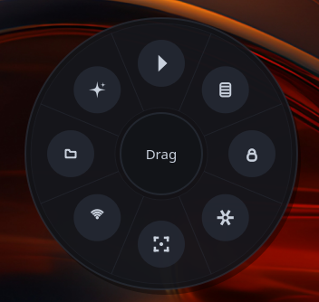
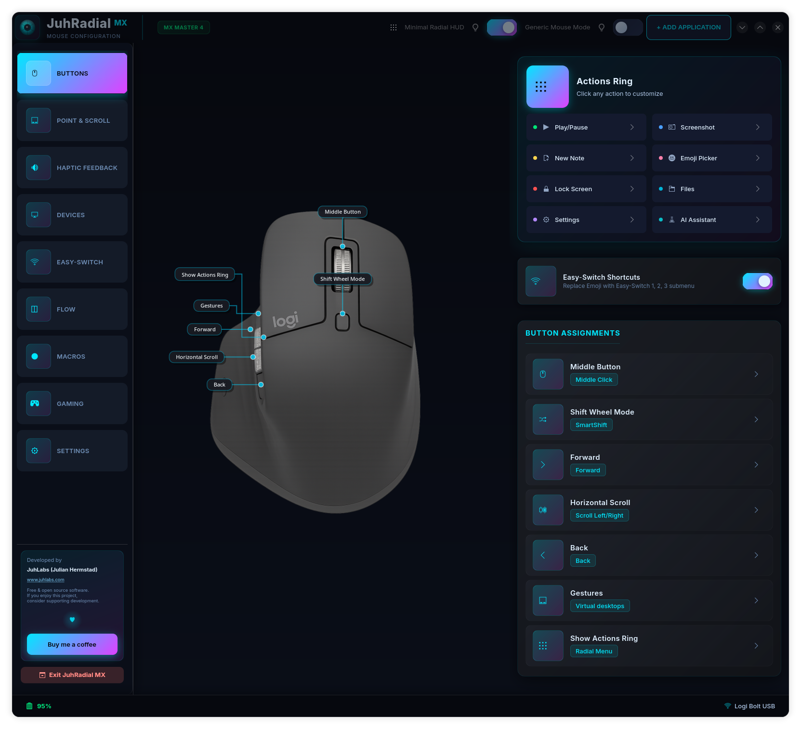
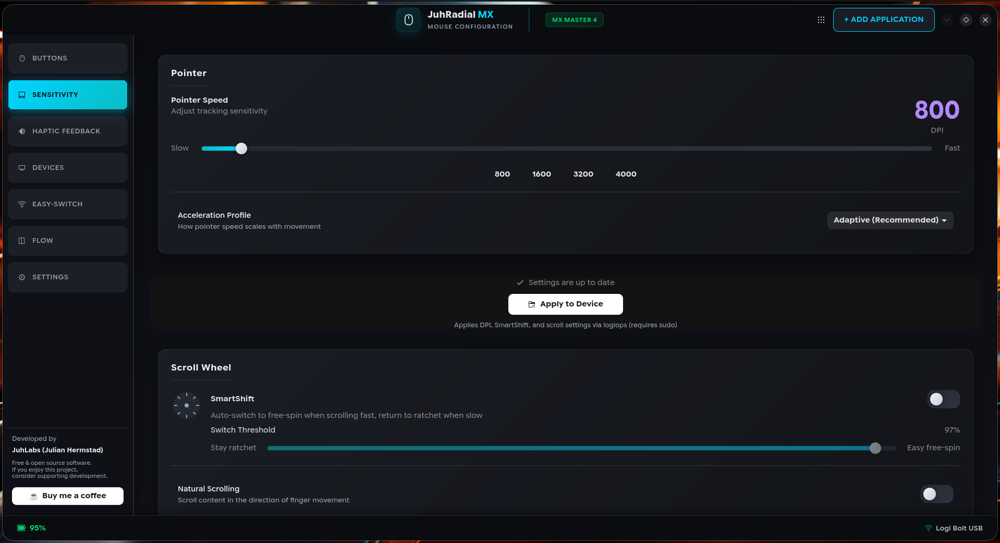
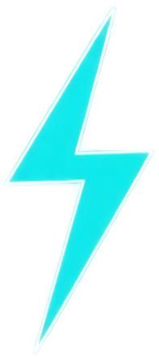
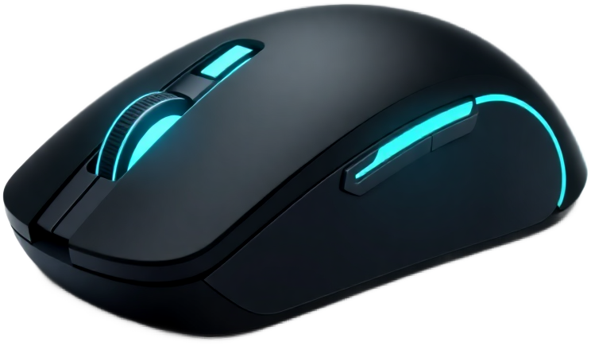

<div align="center">
  
  <h1>JuhRadial MX</h1>
  <p><strong>Beautiful radial menu for Logitech MX Master mice on Linux</strong></p>
  <p>A Logi Options+ inspired experience — works on GNOME, KDE Plasma, Hyprland, COSMIC & more</p>

  <p>
    <a href="https://github.com/JuhLabs/juhradial-mx/releases">
      
    </a>
    <a href="https://github.com/JuhLabs/juhradial-mx/actions/workflows/ci.yml">
      
    </a>
    <a href="https://github.com/JuhLabs/juhradial-mx/actions/workflows/security.yml">
      
    </a>
    <a href="LICENSE">
      
    </a>
    <a href="https://github.com/JuhLabs/juhradial-mx/stargazers">
      
    </a>
    <a href="https://github.com/JuhLabs/juhradial-mx/issues">
      
    </a>
  </p>
</div>

<br>

<div align="center">
  
</div>

<br>

> [!TIP]
> **New in [v0.2.9](CHANGELOG.md):** GNOME Wayland & COSMIC desktop support, multi-monitor HiDPI fixes, 7-level cursor fallback chain. [Update now](#installation).

<div align="center">
  
</div>

## Screenshots

<div align="center">
  <table>
    <tr>
      <td align="center">
        
        <br><em>Radial Menu</em>
      </td>
      <td align="center">
        
        <br><em>3D Neon</em>
      </td>
      <td align="center">
        
        <br><em>3D Blossom</em>
      </td>
    </tr>
    <tr>
      <td colspan="3" align="center">
        
        <br><em>Settings Dashboard</em>
      </td>
    </tr>
    <tr>
      <td colspan="3" align="center">
        
        <br><em>DPI & Scroll Configuration</em>
      </td>
    </tr>
  </table>
</div>

<div align="center">
  
</div>

## Features

<table>
  <tr>
    <td width="50%">
      <h3> Radial Menu</h3>
      Beautiful overlay triggered by gesture button — hold to drag-select or tap to keep open. Fully configurable 8-segment wheel with smooth animations.
    </td>
    <td width="50%">
      <h3> AI Quick Access</h3>
      Submenu with Claude, ChatGPT, Gemini, and Perplexity. Launch your favorite AI assistant with a single gesture.
    </td>
  </tr>
  <tr>
    <td>
      <h3> Settings Dashboard</h3>
      Modern GTK4/Adwaita settings app with Actions Ring configuration, theme picker, DPI control, and Easy-Switch device management.
    </td>
    <td>
      <h3> Multi-Device</h3>
      Easy-Switch host switching with real-time paired device names via HID++. Auto-restarts on device reconnect.
    </td>
  </tr>
  <tr>
    <td>
      <strong>Multiple Themes</strong> — JuhRadial MX, Catppuccin, Nord, Dracula, Solarized, and more<br>
      <strong>Flow</strong> — Multi-computer control with clipboard sync<br>
      <strong>Battery Monitoring</strong> — Real-time status with instant charging detection via HID++
    </td>
    <td>
      <strong>DPI Control</strong> — Visual DPI adjustment (400-8000 DPI)<br>
      <strong>Native Wayland</strong> — GNOME, KDE Plasma 6, Hyprland, COSMIC, Sway & more<br>
      <strong>Multi-Monitor</strong> — Correct cursor positioning across 1-4+ monitors with HiDPI
    </td>
  </tr>
</table>

<div align="center">
  
</div>

## Supported Platforms

<div align="center">

| Desktop Environment | Cursor Detection | Status |
|:---:|:---:|:---:|
| **GNOME** (Ubuntu, Fedora, Pop!_OS) | Shell extension D-Bus | **Fully supported** |
| **KDE Plasma 6** | KWin scripting / D-Bus | **Fully supported** |
| **Hyprland** | IPC socket | **Fully supported** |
| **COSMIC** (Fedora, Pop!_OS) | XWayland sync | **Fully supported** |
| **Sway / wlroots** | XWayland fallback | Supported |
| **X11** (any DE) | xdotool | Supported |

</div>

> **Distros:** Fedora, Ubuntu/Debian, Arch/Manjaro, openSUSE, and derivatives. The installer auto-detects your distro and package manager.

## Supported Devices

<div align="center">
  <table>
    <tr>
      <td align="center" width="200">
        
      </td>
      <td>
        <strong>Logitech MX Master 4</strong> — Fully supported<br>
        <strong>Logitech MX Master 3S</strong> — Fully supported<br>
        <strong>Logitech MX Master 3</strong> — Fully supported
      </td>
    </tr>
  </table>
</div>

<div align="center">
  
</div>

## Installation

> [!IMPORTANT]
> **One-Line Install (Recommended)** — Detects your distro, installs dependencies, builds from source, and configures everything.

```bash
curl -fsSL https://raw.githubusercontent.com/JuhLabs/juhradial-mx/master/install.sh | bash
```

<details>
<summary><strong>Manual Install — Fedora</strong></summary>

```bash
# 1. Install dependencies
sudo dnf install rust cargo logiops python3-pyqt6 qt6-qtsvg \
    python3-gobject gtk4 libadwaita dbus-devel hidapi-devel

# 2. Clone and build
git clone https://github.com/JuhLabs/juhradial-mx.git
cd juhradial-mx
cd daemon && cargo build --release && cd ..

# 3. Configure logiops (maps haptic button to F19)
sudo cp packaging/logid.cfg /etc/logid.cfg
sudo systemctl enable --now logid

# 4. Run
./juhradial-mx.sh
```

</details>

<details>
<summary><strong>Manual Install — Arch Linux</strong></summary>

```bash
# 1. Install dependencies
sudo pacman -S rust python-pyqt6 qt6-svg python-gobject gtk4 libadwaita
yay -S logiops  # or paru -S logiops

# 2. Clone and build
git clone https://github.com/JuhLabs/juhradial-mx.git
cd juhradial-mx
cd daemon && cargo build --release && cd ..

# 3. Configure logiops
sudo cp packaging/logid.cfg /etc/logid.cfg
sudo systemctl enable --now logid

# 4. Run
./juhradial-mx.sh
```

</details>

<details>
<summary><strong>Requirements</strong></summary>

- **Wayland compositor** (GNOME, KDE Plasma 6, Hyprland, COSMIC, Sway) or **X11**
- **logiops** (logid) for button mapping
- **Rust** (for building the daemon)
- **Python 3** with PyQt6 and GTK4/Adwaita
- **XWayland** (for overlay window positioning on Wayland)

</details>

<div align="center">
  
</div>

## Usage

**Hold mode:** Press and hold gesture button → drag to select → release to execute

**Tap mode:** Quick tap gesture button → menu stays open → click to select

### Default Actions (clockwise from top)

<div align="center">

| Position | Action |
|:---:|:---:|
| Top | Play/Pause |
| Top-Right | New Note |
| Right | Lock Screen |
| Bottom-Right | Settings |
| Bottom | Screenshot |
| Bottom-Left | Emoji Picker |
| Left | Files |
| Top-Left | AI (submenu) |

</div>

<div align="center">
  
</div>

## Configuration

Configuration is stored in `~/.config/juhradial/config.json`.

### Themes

Open Settings and select a theme:

| Theme | Description |
|-------|-------------|
| **JuhRadial MX** (default) | Premium dark theme with vibrant cyan accents |
| Catppuccin Mocha | Soothing pastel theme with lavender accents |
| Catppuccin Latte | Light pastel theme |
| Nord | Arctic, north-bluish palette |
| Dracula | Dark theme with vibrant colors |
| Solarized Light | Precision colors for machines and people |
| GitHub Light | Clean light theme |

### Autostart

```bash
# Add to KDE autostart
cp juhradial-mx.desktop ~/.config/autostart/
sed -i "s|Exec=.*|Exec=$(pwd)/juhradial-mx.sh|" ~/.config/autostart/juhradial-mx.desktop
```

<div align="center">
  
</div>

## Hyprland Setup

**Automatic:** The installer detects Hyprland and configures window rules automatically.

<details>
<summary><strong>Manual Setup</strong></summary>

Add these rules to your `hyprland.conf` or `custom/rules.conf`:

```conf
# JuhRadial MX overlay window rules
windowrulev2 = float, title:^(JuhRadial MX)$
windowrulev2 = noblur, title:^(JuhRadial MX)$
windowrulev2 = noborder, title:^(JuhRadial MX)$
windowrulev2 = noshadow, title:^(JuhRadial MX)$
windowrulev2 = pin, title:^(JuhRadial MX)$
windowrulev2 = noanim, title:^(JuhRadial MX)$
```

These rules ensure the radial menu overlay appears correctly on all workspaces without animations or decorations.

</details>

<div align="center">
  
</div>

## Troubleshooting

| Problem | Solution |
|---------|----------|
| Menu doesn't appear | Check logid: `sudo systemctl status logid` |
| Menu at top-left corner | Log out/in to load GNOME extension, or run `gnome-extensions enable juhradial-cursor@dev.juhlabs.com` |
| Mouse not detected | Should auto-recover (udev restarts logid). Manual fix: `sudo systemctl restart logid` |
| Build fails | Install dev packages: `hidapi-devel`, `dbus-devel` |
| Hyprland: Menu hidden | Add window rules from Hyprland Setup section above |
| GNOME: Extension not loading | Requires session restart (log out/in) on Wayland |

<details>
<summary><strong>Debug Mode</strong></summary>

```bash
# Run daemon with verbose output
./daemon/target/release/juhradiald --verbose
```

</details>

<div align="center">
  
</div>

## How It Works

```
┌──────────────┐     D-Bus      ┌──────────────────┐    PyQt6     ┌──────────────┐
│  Logitech MX │ ──── logid ──→ │  juhradiald       │ ──────────→ │  Radial Menu │
│  Master      │   (F19 key)    │  (Rust daemon)    │  overlay    │  (8 segments)│
└──────────────┘                │                    │             └──────────────┘
                                │  Cursor Detection: │
                                │  Hyprland IPC      │             ┌──────────────┐
                                │  KWin D-Bus        │ ──────────→ │  Settings    │
                                │  GNOME Extension   │   GTK4      │  (Adwaita)   │
                                │  XWayland          │             └──────────────┘
                                │  xdotool           │
                                └──────────────────┘
```

## Project Structure

```
juhradial-mx/
├── daemon/              # Rust daemon (HID++ listener, D-Bus, cursor detection)
│   └── src/cursor.rs    # 7-level cursor fallback chain
├── overlay/             # Python UI
│   ├── juhradial-overlay.py   # Main overlay entry point
│   ├── overlay_cursor.py      # Multi-compositor cursor detection
│   ├── overlay_actions.py     # Radial menu actions & themes
│   ├── overlay_painting.py    # Qt rendering & animations
│   └── settings_*.py          # GTK4/Adwaita settings app
├── gnome-extension/     # GNOME Shell cursor helper extension
├── assets/              # Icons, themes, and screenshots
└── packaging/           # logid.cfg, systemd, udev rules
```

<div align="center">
  
</div>

## Contributing

Contributions are welcome! See [CONTRIBUTING.md](CONTRIBUTING.md) for guidelines.

## License

GNU General Public License v3.0 — see [LICENSE](LICENSE)

## Acknowledgments

- [logiops](https://github.com/PixlOne/logiops) — Logitech device configuration
- [logitech-flow-kvm](https://github.com/coddingtonbear/logitech-flow-kvm) by Adam Coddington — Flow multi-computer control inspiration
- [Catppuccin](https://github.com/catppuccin/catppuccin) — Beautiful color scheme

<div align="center">
  
</div>

## Star History

<div align="center">
  <a href="https://star-history.com/#JuhLabs/juhradial-mx&Date">
    <picture>
      <source media="(prefers-color-scheme: dark)" srcset="https://api.star-history.com/svg?repos=JuhLabs/juhradial-mx&type=Date&theme=dark" />
      <source media="(prefers-color-scheme: light)" srcset="https://api.star-history.com/svg?repos=JuhLabs/juhradial-mx&type=Date" />
      
    </picture>
  </a>
</div>

> If you find JuhRadial MX useful, consider giving it a star — it helps others discover the project!

<br>

## Disclaimer

This project is **not affiliated with, endorsed by, or associated with Logitech** in any way. "Logitech", "MX Master", "Logi Options+", and related names are trademarks of Logitech International S.A. This is an independent, open-source project created by the community for the community.

<br>

<div align="center">
  
  <br><br>
  <strong>Made with love by <a href="https://github.com/JuhLabs">JuhLabs</a></strong>
  <br><br>
  <a href="https://github.com/JuhLabs/juhradial-mx/issues">Report Bug</a> · <a href="https://github.com/JuhLabs/juhradial-mx/issues">Request Feature</a> · <a href="https://github.com/JuhLabs/juhradial-mx/discussions">Discussions</a>
</div>
