<div align="center">
  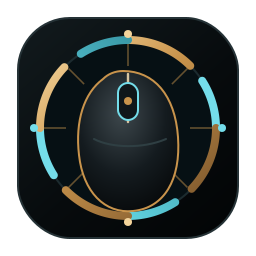
  <h1>JuhRadial MX</h1>
  <p><strong>The ultimate Logitech MX Master experience on Linux</strong></p>
  <p>Radial menu, cross-computer Flow, DPI control, haptic feedback - all native on Wayland</p>

  <p>
    <a href="https://github.com/JuhLabs/juhradial-mx/releases">
      
    </a>
    <a href="https://github.com/JuhLabs/juhradial-mx/actions/workflows/ci.yml">
      
    </a>
    <a href="https://github.com/JuhLabs/juhradial-mx/actions/workflows/security.yml">
      
    </a>
    <a href="LICENSE">
      
    </a>
    <a href="https://github.com/JuhLabs/juhradial-mx/stargazers">
      
    </a>
    <a href="https://github.com/JuhLabs/juhradial-mx/issues">
      
    </a>
  </p>
</div>

<br>

<div align="center">
  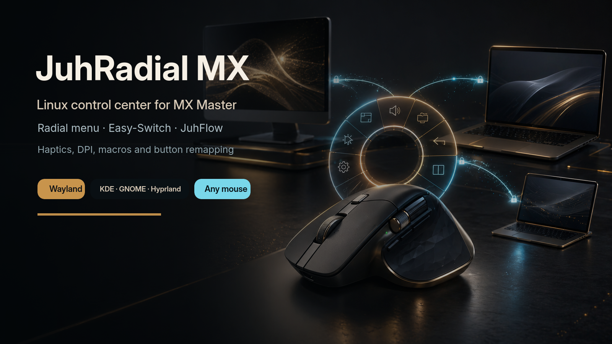
</div>

<br>

> [!TIP]
> **Current official release: [v0.3.2](CHANGELOG.md).** Promotes the 0.3.x beta line with config-driven button actions, JuhFlow, generic mouse mode, refreshed settings artwork, and a reconnect fix for MX Master Easy-Switch.
>
> **Mac users:** Want to try JuhFlow cross-computer control? [Download JuhFlow.dmg](https://github.com/JuhLabs/juhradial-mx/raw/master/juhflow/JuhFlow.dmg) (signed & notarized) - install it on your Mac, then enable Flow in JuhRadial MX Settings on Linux. Both machines auto-discover each other on your local network.

<div align="center">
  
</div>

## Release Highlights

<div align="center">
  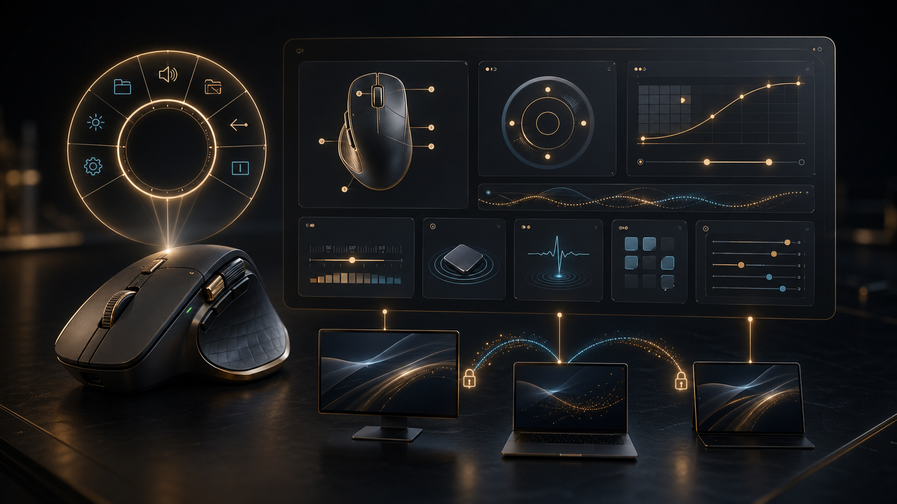
</div>

<table>
  <tr>
    <td width="50%">
      <strong>Reconnect-safe radial button</strong><br>
      Easy-Switch host changes no longer leave the radial wheel stuck after returning to Linux. The daemon re-applies HID++ diverts and the evdev fallback maps the MX thumb/radial control correctly.
    </td>
    <td width="50%">
      <strong>Official 0.3.x release</strong><br>
      Button remapping, generic mouse support, JuhFlow, macro triggers, gaming mode, and multi-desktop cursor detection are now bundled into the stable release line.
    </td>
  </tr>
  <tr>
    <td>
      <strong>Settings dashboard refresh</strong><br>
      Buttons, Devices, Easy-Switch, and Haptics pages now use generated product artwork while preserving the clean GTK4/Adwaita layout.
    </td>
    <td>
      <strong>Installer cleanup</strong><br>
      Generated settings assets are installed with the app, and the development sync script no longer depends on a machine-specific source path.
    </td>
  </tr>
</table>

<div align="center">
  
</div>

## Installation

> [!IMPORTANT]
> **One-Line Install (Recommended)** - Detects your distro, installs dependencies, builds from source, and configures everything.

```bash
curl -fsSL https://raw.githubusercontent.com/JuhLabs/juhradial-mx/master/install.sh | bash
```

<details>
<summary><strong>Manual Install - Fedora</strong></summary>

```bash
# 1. Install dependencies
sudo dnf install rust cargo python3-pyqt6 qt6-qtsvg \
    python3-gobject gtk4 libadwaita dbus-devel hidapi-devel

# 2. Clone and build
git clone https://github.com/JuhLabs/juhradial-mx.git
cd juhradial-mx
cd daemon && cargo build --release && cd ..

# 3. Run
./scripts/juhradial-mx.sh
```

</details>

<details>
<summary><strong>Manual Install - Arch Linux</strong></summary>

```bash
# 1. Install dependencies
sudo pacman -S rust python-pyqt6 qt6-svg python-gobject gtk4 libadwaita

# 2. Clone and build
git clone https://github.com/JuhLabs/juhradial-mx.git
cd juhradial-mx
cd daemon && cargo build --release && cd ..

# 3. Run
./scripts/juhradial-mx.sh
```

</details>

<details>
<summary><strong>Requirements</strong></summary>

- **Wayland compositor** (GNOME, KDE Plasma 6, Hyprland, COSMIC, Sway) or **X11**
- **Rust** (for building the daemon)
- **Python 3** with PyQt6 and GTK4/Adwaita
- **XWayland** (for overlay window positioning on Wayland)

</details>

<div align="center">
  
</div>

## Screenshots

<div align="center">
  <table>
    <tr>
      <td align="center">
        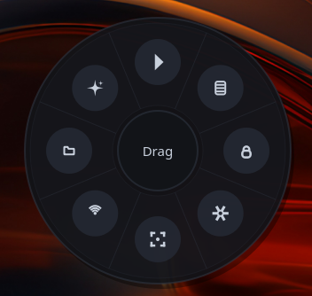
        <br><em>Radial Menu</em>
      </td>
      <td align="center">
        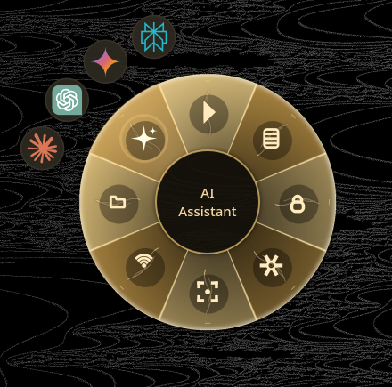
        <br><em>3D Neon</em>
      </td>
      <td align="center">
        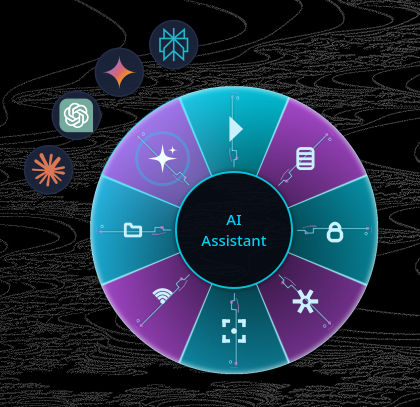
        <br><em>3D Blossom</em>
      </td>
    </tr>
    <tr>
      <td colspan="3" align="center">
        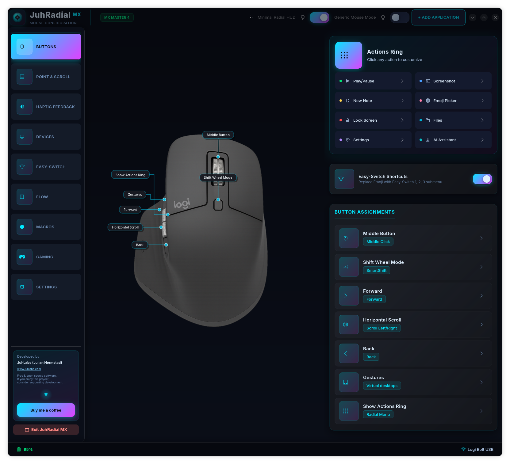
        <br><em>Settings Dashboard</em>
      </td>
    </tr>
  </table>
</div>

<div align="center">
  
</div>

## Features

<table>
  <tr>
    <td width="50%">
      <h3>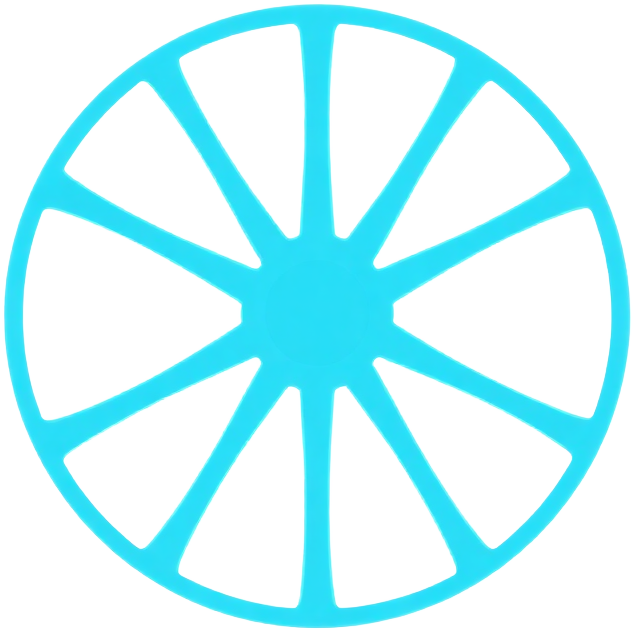 Radial Menu</h3>
      Beautiful overlay triggered by gesture button - hold to drag-select or tap to keep open. Fully configurable 8-segment wheel with smooth animations and 3D themes.
    </td>
    <td width="50%">
      <h3>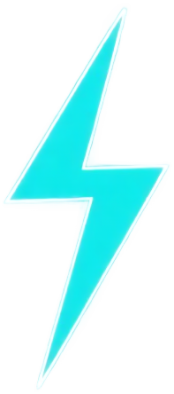 JuhFlow</h3>
      Cross-computer control between Linux and Mac. Move your cursor across machines, share clipboard, all over encrypted connections (X25519 + AES-256-GCM). No cloud required.
    </td>
  </tr>
  <tr>
    <td>
      <h3>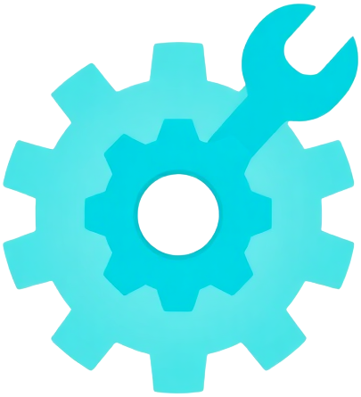 Settings Dashboard</h3>
      Modern GTK4/Adwaita settings with macro editor, gaming mode, DPI/sensitivity controls, button remapping, theme picker, and Easy-Switch device management.
    </td>
    <td>
      <h3>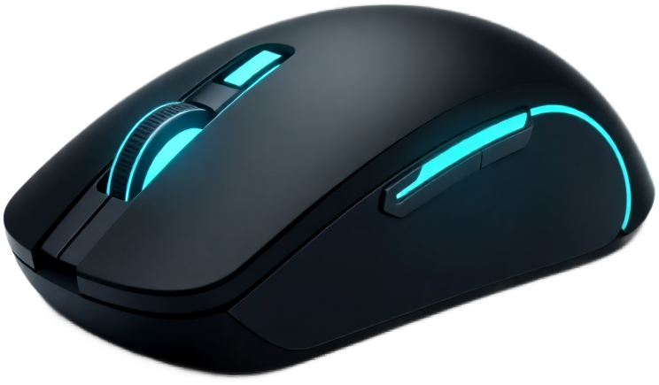 Multi-Device</h3>
      Easy-Switch host switching with real-time paired device names via HID++. Reconnects cleanly after switching away and back. Generic mouse mode supports any mouse with evdev.
    </td>
  </tr>
  <tr>
    <td>
      <strong>Macros</strong> - Key sequences, delays, text typing, WhileHolding loops<br>
      <strong>Gaming Mode</strong> - Bind any mouse button to macros via evdev<br>
      <strong>Battery Monitoring</strong> - Real-time status with instant charging detection via HID++
    </td>
    <td>
      <strong>AI Quick Access</strong> - Claude, ChatGPT, Gemini, Perplexity in a submenu<br>
      <strong>Native Wayland</strong> - GNOME, KDE Plasma 6, Hyprland, COSMIC, Sway & more<br>
      <strong>Multiple Themes</strong> - JuhRadial MX, Catppuccin, Nord, Dracula, Solarized & more
    </td>
  </tr>
</table>

<div align="center">
  
</div>

## JuhFlow - Cross-Computer Control

Move your cursor seamlessly between your Linux and Mac machines. Encrypted, peer-to-peer, no cloud.

<div align="center">
  <table>
    <tr>
      <td align="center">
        
        <br><br>
        <a href="https://github.com/JuhLabs/juhradial-mx/raw/master/juhflow/JuhFlow.dmg">
          
        </a>
        <br><br>
        <em>Signed & notarized by Apple - install and run directly</em>
      </td>
    </tr>
  </table>
</div>

- **Linux side:** Built into JuhRadial MX - just enable Flow in Settings
- **Mac side:** Download JuhFlow.dmg above, install, and pair
- **Encrypted:** X25519 key exchange + AES-256-GCM - all traffic is end-to-end encrypted
- **Zero config:** Auto-discovers peers on your local network
- **Windows support:** Coming soon

> **Note:** If you quit JuhRadial MX while JuhFlow is connected, you'll need to restart JuhFlow on the Mac side and reconnect.

<div align="center">
  
</div>

## Supported Platforms

<div align="center">

| Desktop Environment | Cursor Detection | Status |
|:---:|:---:|:---:|
| **GNOME** (Ubuntu, Fedora, Pop!_OS) | Shell extension D-Bus | **Fully supported** |
| **KDE Plasma 6** (Kubuntu, Fedora KDE) | KWin scripting / D-Bus | **Fully supported** |
| **Hyprland** | IPC socket | **Fully supported** |
| **COSMIC** (Fedora, Pop!_OS) | XWayland sync | **Fully supported** |
| **Sway / wlroots** | XWayland fallback | Supported |
| **X11** (any DE) | xdotool | Supported |

</div>

> **Distros:** Fedora, Ubuntu/Debian, Arch/Manjaro, openSUSE, NixOS, and derivatives. The installer auto-detects your distro and package manager.

## Supported Devices

<div align="center">
  <table>
    <tr>
      <td align="center" width="200">
        
      </td>
      <td>
        <strong>Logitech MX Master 4</strong> - Full HID++ support<br>
        <strong>Logitech MX Master 3S</strong> - Full HID++ support<br>
        <strong>Logitech MX Master 3</strong> - Full HID++ support<br>
        <strong>Any mouse</strong> - Generic mode with evdev (radial menu + button remapping)
      </td>
    </tr>
  </table>
</div>

<div align="center">
  
</div>

## Usage

**Hold mode:** Press and hold gesture button - drag to select - release to execute

**Tap mode:** Quick tap gesture button - menu stays open - click to select

### Default Actions (clockwise from top)

<div align="center">

| Position | Action |
|:---:|:---:|
| Top | Play/Pause |
| Top-Right | New Note |
| Right | Lock Screen |
| Bottom-Right | Settings |
| Bottom | Screenshot |
| Bottom-Left | Emoji Picker |
| Left | Files |
| Top-Left | AI (submenu) |

</div>

<div align="center">
  
</div>

## Configuration

Configuration is stored in `~/.config/juhradial/config.json`.

### Themes

Open Settings and select a theme:

| Theme | Description |
|-------|-------------|
| **JuhRadial MX** (default) | Premium dark theme with vibrant cyan accents |
| Catppuccin Mocha | Soothing pastel theme with lavender accents |
| Catppuccin Latte | Light pastel theme |
| Nord | Arctic, north-bluish palette |
| Dracula | Dark theme with vibrant colors |
| Solarized Light | Precision colors for machines and people |
| GitHub Light | Clean light theme |

### Autostart

The installer sets up autostart automatically. For manual setup:

```bash
cp packaging/juhradial-mx.desktop ~/.config/autostart/
sed -i "s|Exec=.*|Exec=$(pwd)/scripts/juhradial-mx.sh|" ~/.config/autostart/juhradial-mx.desktop
```

<div align="center">
  
</div>

## Hyprland Setup

**Automatic:** The installer detects Hyprland and configures window rules automatically.

<details>
<summary><strong>Manual Setup</strong></summary>

Add these rules to your `hyprland.conf` or `custom/rules.conf`:

```conf
# JuhRadial MX overlay window rules
windowrulev2 = float, title:^(JuhRadial MX)$
windowrulev2 = noblur, title:^(JuhRadial MX)$
windowrulev2 = noborder, title:^(JuhRadial MX)$
windowrulev2 = noshadow, title:^(JuhRadial MX)$
windowrulev2 = pin, title:^(JuhRadial MX)$
windowrulev2 = noanim, title:^(JuhRadial MX)$
```

</details>

<div align="center">
  
</div>

## Troubleshooting

| Problem | Solution |
|---------|----------|
| Menu doesn't appear | Check daemon is running: `pgrep juhradiald` or restart via the desktop launcher |
| Menu stops after Easy-Switch | Update to v0.3.2 or newer, then restart JuhRadial MX so the HID++ reconnect and evdev fallback fixes are active |
| Menu at top-left corner | Log out/in to load GNOME extension, or run `gnome-extensions enable juhradial-cursor@dev.juhlabs.com` |
| Mouse not detected | Check HID permissions: ensure your user is in the `input` group |
| Build fails | Install dev packages: `hidapi-devel`, `dbus-devel` |
| Hyprland: Menu hidden | Add window rules from Hyprland Setup section above |

<details>
<summary><strong>Debug Mode</strong></summary>

```bash
# Run daemon with verbose output
./daemon/target/release/juhradiald --verbose
```

</details>

<div align="center">
  
</div>

## Architecture

```
                                    JuhRadial MX
                                    ============

  +--------------+    HID++      +------------------+    PyQt6      +--------------+
  | Logitech MX  | -- hidraw --> |  juhradiald      | -----------> | Radial Menu  |
  | Master       |   (native)   |  (Rust daemon)   |   overlay    | (8 segments) |
  +--------------+               |                  |              +--------------+
                                 | Cursor detection |
  +--------------+               | - Hyprland IPC   |              +--------------+
  | Any Mouse    | -- evdev ---> | - KWin D-Bus     | -----------> | Settings     |
  | (generic)    |               | - GNOME ext      |    GTK4      | (Adwaita)    |
  +--------------+               | - XWayland       |              +--------------+
                                 +------------------+
                                        |
                                   JuhFlow (encrypted)
                                        |
                                 +------------------+
                                 |  Mac / Windows   |
                                 |  companion app   |
                                 +------------------+
```

## Project Structure

```
juhradial-mx/
+-- daemon/              # Rust daemon (HID++ listener, D-Bus, cursor detection)
+-- overlay/             # Python UI (overlay + GTK4 settings)
|   +-- flow/            # JuhFlow multi-computer control
|   +-- locales/         # Translations (19 languages)
+-- juhflow/             # JuhFlow Mac companion app (Swift + Python)
+-- gnome-extension/     # GNOME Shell cursor helper extension
+-- scripts/             # Launcher scripts
+-- packaging/           # Desktop files, Flatpak, RPM, Arch, systemd
+-- assets/              # Icons, themes, and screenshots
+-- tests/               # Test utilities
```

<div align="center">
  
</div>

## Contributing

Contributions are welcome! See [CONTRIBUTING.md](CONTRIBUTING.md) for guidelines.

## License

GNU General Public License v3.0 - see [LICENSE](LICENSE)

<div align="center">
  
</div>

## Star History

<div align="center">
  <a href="https://star-history.com/#JuhLabs/juhradial-mx&Date">
    <picture>
      <source media="(prefers-color-scheme: dark)" srcset="https://api.star-history.com/svg?repos=JuhLabs/juhradial-mx&type=Date&theme=dark" />
      <source media="(prefers-color-scheme: light)" srcset="https://api.star-history.com/svg?repos=JuhLabs/juhradial-mx&type=Date" />
      
    </picture>
  </a>
</div>

> If you find JuhRadial MX useful, consider giving it a star - it helps others discover the project!

<br>

## Disclaimer

This project is **not affiliated with, endorsed by, or associated with Logitech** in any way. "Logitech", "MX Master", "Logi Options+", and related names are trademarks of Logitech International S.A. This is an independent, open-source project created by the community for the community.

<br>

<div align="center">
  
  <br><br>
  <strong>Made with love by <a href="https://github.com/JuhLabs">JuhLabs</a></strong>
  <br><br>
  <a href="https://github.com/JuhLabs/juhradial-mx/issues">Report Bug</a> - <a href="https://github.com/JuhLabs/juhradial-mx/issues">Request Feature</a> - <a href="https://github.com/JuhLabs/juhradial-mx/discussions">Discussions</a>
</div>
