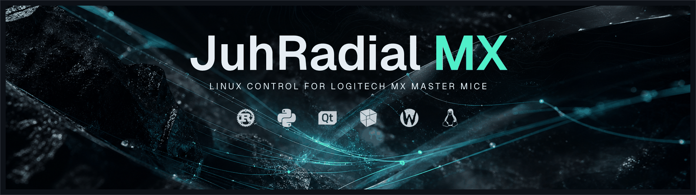
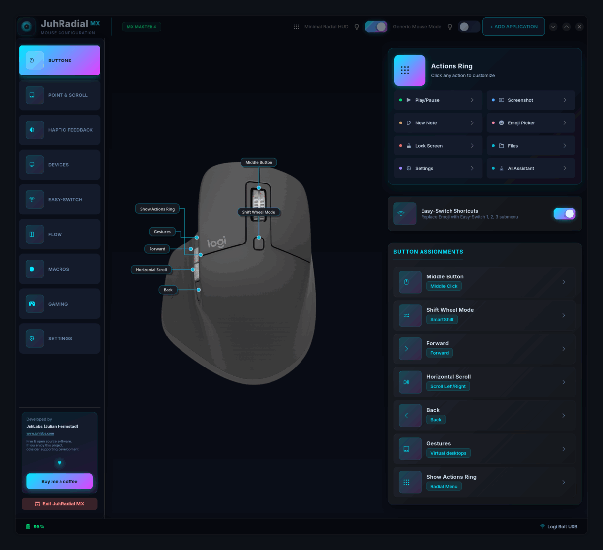
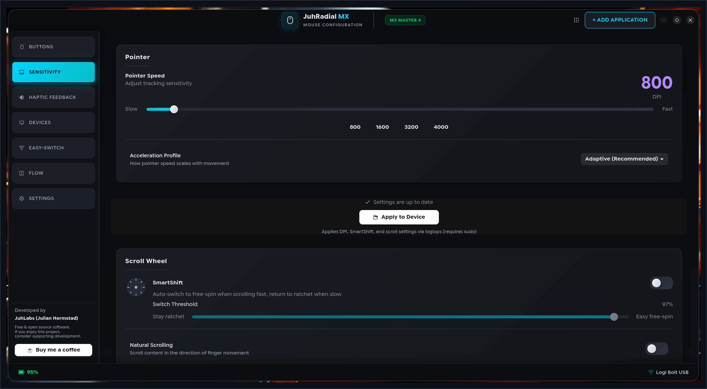
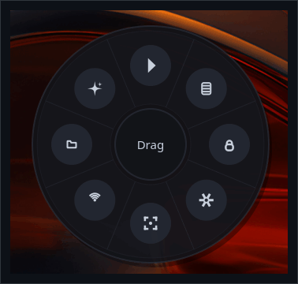
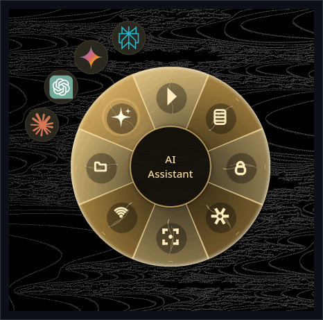
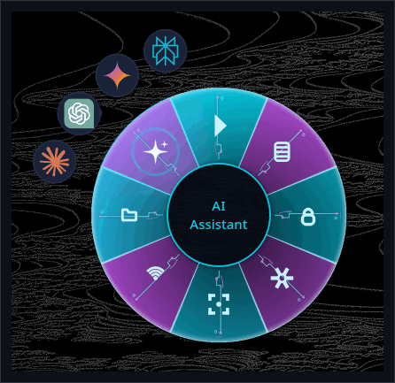
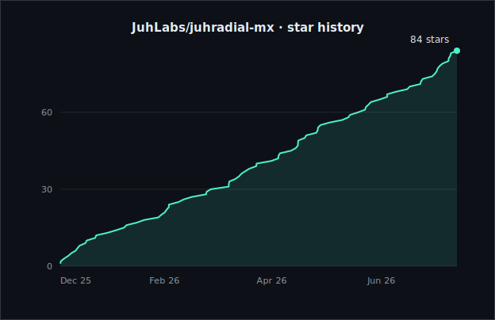

<div align="center">
  
</div>

<div align="center">
  
</div>

<div align="center">
  <p><strong>Open-source Linux control for Logitech MX Master mice.</strong></p>
  <p>Get radial actions, button remapping, per-app profiles, MX Master 4 haptics, Easy-Switch, and cross-computer control on Wayland and X11.</p>

  <p>
    <a href="https://github.com/JuhLabs/juhradial-mx/releases">
      
    </a>
    <a href="https://juhlabs.github.io/juhradial-mx/">
      
    </a>
    <a href="https://github.com/JuhLabs/juhradial-mx/actions/workflows/ci.yml">
      
    </a>
    <a href="https://www.bestpractices.dev/projects/13701">
      
    </a>
    <a href="LICENSE">
      
    </a>
    <a href="https://github.com/JuhLabs/juhradial-mx/stargazers">
      
    </a>
  </p>
</div>

<!-- DEMO GIF: record a short 3-5s clip of the radial menu (hold the gesture button,
     drag to a slice, release), save it as assets/github/demo.gif, and uncomment:
<div align="center">
  
  <br><em>Hold the gesture button, drag to a slice, release.</em>
</div>
-->

> [!TIP]
> **New in [v0.4.1](CHANGELOG.md):** Better GNOME Wayland cursor placement, tap-to-close, single-overlay enforcement ([#60](https://github.com/JuhLabs/juhradial-mx/issues/60)), working thumb-wheel assignments, and desktop-aware screenshots. [Update now](#installation).

## Installation

The one-line installer supports Fedora/RHEL, Debian/Ubuntu, Arch, and openSUSE families. It previews its changes, requests `sudo` only for package and system paths, then configures the daemon, device permissions, desktop integration, and user service.

```bash
curl -fsSL https://raw.githubusercontent.com/JuhLabs/juhradial-mx/master/install.sh | bash
```

Run it as your normal user. See the [installation guide](https://juhlabs.github.io/juhradial-mx/installation/) for requirements and a step-by-step explanation.

### Other installation paths

| Path | Command or source |
|---|---|
| **Nix package, core app** | `nix run github:JuhLabs/juhradial-mx` |
| **NixOS module** | Import `juhradial-mx.nixosModules.default`, then configure the user service and `input` group |
| **Nix development shell** | `nix develop github:JuhLabs/juhradial-mx` |
| **Build from source** | [Clone the repository](https://github.com/JuhLabs/juhradial-mx.git), build `daemon/` with Cargo, then run `scripts/juhradial-mx.sh` |
| **Manual distro setup** | Use the [Fedora, Arch, Ubuntu/Debian, or openSUSE instructions](https://juhlabs.github.io/juhradial-mx/installation/#manual-installation-per-distro) |
| **Experimental distro packaging** | [Arch PKGBUILD](packaging/arch/PKGBUILD), [RPM spec](packaging/rpm/juhradial-mx.spec), and [Flatpak manifest](packaging/org.juhlabs.JuhRadialMX.yaml) |

The distro manifests are packaging starting points, not published or verified release packages. The Nix path covers the core app but does not configure `ydotool`, `uinput`, or JuhFlow dependencies; follow the full guide for those features.

## Product

JuhRadial MX combines a Rust HID++ daemon, PyQt6 radial overlay, and GTK4/libadwaita settings app. MX Master 4 exposes the full feature set, including actuator haptics; MX Master 3S and 3 use their available HID++ controls, while most mice with extra buttons can use generic evdev remapping.

### Real interface captures

<div align="center">
  
  <br><sub>Live settings dashboard with device state, button assignments, and application profiles</sub>
</div>

<br>

<div align="center">
  
  <br><sub>Pointer sensitivity, acceleration, SmartShift, and scroll controls</sub>
</div>

<br>

<div align="center">
  <table>
    <tr>
      <td align="center">
        
        <br><sub>Radial menu</sub>
      </td>
      <td align="center">
        
        <br><sub>Golden Classic</sub>
      </td>
      <td align="center">
        
        <br><sub>Neon Sci-Fi</sub>
      </td>
    </tr>
  </table>
</div>

## Capabilities

| Capability | What it provides |
|---|---|
| **Radial menu** | Configurable eight-segment overlay with hold-and-drag or tap-to-open interaction, animations, and 3D themes. |
| **Button remapping and macros** | Map controls to shortcuts, delays, typed text, repeating loops, system actions, or evdev-backed Gaming Mode. |
| **MX Master 4 haptics** | Tune actuator feedback for selections and supported interactions on MX Master 4 hardware. |
| **Pointer and scroll control** | Adjust 400 to 8000 DPI presets, sensitivity, SmartShift, high-resolution scrolling, and scroll speed. |
| **Thumb wheel** | Bind the side wheel to volume, zoom, horizontal scrolling, or off, with direction and speed controls. |
| **Per-app profiles** | Switch pointer and wheel behavior by app, with native focus tracking on KDE, Hyprland, and X11 and XWayland tracking elsewhere. |
| **Easy-Switch and device state** | Switch among three paired hosts and monitor battery, charging, DPI, ratchet state, and active host across Bolt, Unifying, and Bluetooth. |
| **Settings dashboard** | Search and edit buttons, macros, haptics, pointer behavior, themes, profiles, Easy-Switch, and JuhFlow. |
| **Quick-access actions** | Open services, files, notes, desktop actions, and custom commands from the wheel. |
| **Desktop integration** | Wayland-first support across major compositors plus X11, with XWayland used for overlay placement on Wayland. |

Full feature and configuration guides are at [juhlabs.github.io/juhradial-mx](https://juhlabs.github.io/juhradial-mx/).

## JuhFlow

JuhFlow moves the cursor and clipboard between Linux and macOS over the local network, with no cloud account or relay.

<div align="center">
  <a href="https://github.com/JuhLabs/juhradial-mx/raw/master/juhflow/JuhFlow.dmg">
    
  </a>
  <br><br>
  <sub>macOS companion disk image</sub>
</div>

| Area | Status |
|---|---|
| **Linux** | Built in; enable Flow in Settings. |
| **macOS** | Download `JuhFlow.dmg`, then follow the runtime setup in [juhflow/README.md](juhflow/README.md). |
| **Network and security** | Local UDP discovery with X25519 key agreement and AES-256-GCM encrypted control and clipboard payloads. |
| **Windows** | Companion support is planned. |

> [!WARNING]
> The checked-in macOS disk image is not a standalone installer. Its GUI launches `~/Downloads/juhflow/.venv/bin/python3` and `~/Downloads/juhflow/juhflow_app.py` at fixed paths. Place the engine and virtual environment there, or run the Python CLI directly. Runtime dependencies are described in [juhflow/README.md](juhflow/README.md), including `cryptography`, PyObjC, and `blueutil`. Easy-Switch automation also expects the Logi Options+ agent.

> [!IMPORTANT]
> If JuhRadial MX is closed while JuhFlow is connected, restart JuhFlow on macOS and reconnect.

## Compatibility

### Desktop and compositor support

| Desktop environment | Cursor detection | Overlay support |
|:---|:---|:---:|
| **GNOME** (Ubuntu, Fedora, Pop!_OS) | Shell extension over D-Bus | **Fully supported** |
| **KDE Plasma 6** (Kubuntu, Fedora KDE) | KWin scripting and D-Bus | **Fully supported** |
| **Hyprland** | IPC socket | **Fully supported** |
| **COSMIC** (Fedora, Pop!_OS) | XWayland synchronization | **Fully supported** |
| **Sway / wlroots** | XWayland fallback | Supported |
| **niri** | XWayland through `xwayland-satellite` | Supported |
| **X11** (any desktop) | XQueryPointer with `xdotool` fallback | Supported |

Per-app focus tracking is native on KDE Plasma, Hyprland, and X11. GNOME, COSMIC, Sway, and niri can track XWayland clients, while native Wayland application identification remains compositor-dependent. See [compositor support](https://juhlabs.github.io/juhradial-mx/compositor-support/) for exact behavior.

### Device support

| Device | Support |
|---|---|
| **Logitech MX Master 4** | Primary target. HID++ controls, radial input, button remapping, Easy-Switch, live state, and actuator haptics. |
| **Logitech MX Master 3S** | HID++ controls, radial input, button remapping, Easy-Switch, and live state supported where exposed by the device. |
| **Logitech MX Master 3** | HID++ controls, radial input, button remapping, Easy-Switch, and live state supported where exposed by the device. |
| **Most non-Logitech mice** | Generic evdev mode for extra-button radial input and remapping. |

## Usage

| Mode | Interaction |
|---|---|
| **Hold** | Press and hold the configured radial-menu button, drag to a segment, then release to execute. On MX Master 4, the Actions Ring button is the default. |
| **Tap** | Tap the configured radial-menu button, leave the menu open, then click a segment. A second tap closes it. |

Actions and layout are fully configurable in Settings. See the [complete documentation](https://juhlabs.github.io/juhradial-mx/) for profiles, themes, macros, and defaults.

## Configuration

Configuration is stored in:

```text
~/.config/juhradial/config.json
```

Use Settings to manage buttons, macros, themes, profiles, device behavior, and JuhFlow. The installer enables the background daemon; enable **Start at Login** in Settings for the overlay. See the [complete documentation](https://juhlabs.github.io/juhradial-mx/) and [compositor support guide](https://juhlabs.github.io/juhradial-mx/compositor-support/) for manual setup, including Hyprland rules.

## Troubleshooting

| Problem | Resolution |
|---|---|
| Menu does not appear | Check the daemon with `pgrep juhradiald`, or restart it from the desktop launcher. |
| Menu opens at the top-left | Log out and back in to load the GNOME extension, or run `gnome-extensions enable juhradial-cursor@dev.juhlabs.com`. |
| Mouse is not detected | Check HID permissions and confirm that the user belongs to the `input` group. |
| Build fails | Install the required development packages, including `hidapi-devel` and `dbus-devel` on Fedora-family systems. |
| Menu is hidden on Hyprland | Add the rules from the [compositor support guide](https://juhlabs.github.io/juhradial-mx/compositor-support/). |

Run the daemon directly for verbose diagnostics:

```bash
./daemon/target/release/juhradiald --verbose
```

See the [troubleshooting guide](https://juhlabs.github.io/juhradial-mx/troubleshooting/) for service, permissions, compositor, and device-specific diagnostics.

## Uninstall

Stop user services before deleting installed files. The daemon and overlay run as the current user, so the user-service, autostart, and configuration steps do not require root. Files under `/usr/local`, `/usr/share`, and `/etc` do.

> [!CAUTION]
> Removing `~/.config/juhradial` deletes themes, button maps, macros, profiles, and Flow pairing state.

```bash
# 1. Stop and disable the JuhRadial user service
systemctl --user disable --now juhradialmx-daemon.service
rm -f ~/.config/systemd/user/juhradialmx-daemon.service

# Only run these two lines if JuhRadial created this user unit
systemctl --user disable --now ydotoold.service
rm -f ~/.config/systemd/user/ydotoold.service

systemctl --user daemon-reload

# 2. Remove the autostart entry
rm -f ~/.config/autostart/juhradial-mx.desktop

# 3. Remove binaries, assets, desktop entries, and the icon
sudo rm -f  /usr/local/bin/juhradiald \
            /usr/local/bin/juhradial-mx \
            /usr/local/bin/juhradial-settings
sudo rm -rf /usr/share/juhradial /opt/juhradial-mx
sudo rm -f  /usr/share/applications/juhradial-mx.desktop \
            /usr/share/applications/org.kde.juhradialmx.settings.desktop \
            /usr/share/icons/hicolor/scalable/apps/juhradial-mx.svg

# 4. Remove udev rules and uinput module configuration, then reload
sudo rm -f  /etc/udev/rules.d/99-juhradialmx.rules \
            /etc/udev/rules.d/60-ydotool-uinput.rules \
            /etc/modules-load.d/juhradial-uinput.conf
sudo udevadm control --reload-rules && sudo udevadm trigger

# 5. Remove user configuration
rm -rf ~/.config/juhradial
```

GNOME users should also disable and remove the cursor helper:

```bash
gnome-extensions disable juhradial-cursor@dev.juhlabs.com
rm -rf ~/.local/share/gnome-shell/extensions/juhradial-cursor@dev.juhlabs.com
```

Hyprland users should remove the `JuhRadial MX` rules block added under `~/.config/hypr/`, typically `~/.config/hypr/juhradial-rules.conf` or a section in `hyprland.conf`.

## Architecture

| Component | Role |
|---|---|
| `daemon/` | Rust HID++, evdev, D-Bus, device-state, and cursor-detection service |
| `overlay/` | PyQt6 radial menu, GTK4/libadwaita settings, and Linux JuhFlow engine |
| `gnome-extension/` | GNOME Wayland cursor-position helper |
| `juhflow/` | Swift and Python macOS companion |
| `packaging/` | Desktop integration, systemd, udev, Nix, and distro manifests |

See [docs/architecture.md](docs/architecture.md) for the component boundaries and data flow.

## Contributing

Contributions are welcome. Read [CONTRIBUTING.md](CONTRIBUTING.md) for the development workflow and submission guidelines.

## License

JuhRadial MX is licensed under the [GNU General Public License v3.0](LICENSE).

## Star history

<div align="center">
  <a href="https://github.com/JuhLabs/juhradial-mx/stargazers">
    
  </a>
</div>

<!-- Chart is rendered weekly by .github/workflows/star-history.yml.
     GitHub restricts stargazer timestamps to repository admins, so external
     chart services (star-history.com) can no longer serve public embeds. -->

If JuhRadial MX is useful to you, a star helps other Linux users find the project.

## Trademark notice

JuhRadial MX is not affiliated with, endorsed by, or associated with Logitech. Logitech, MX Master, Logi Options+, and related names are trademarks of Logitech International S.A. This is an independent, community-built open-source project.

<p align="center">
  Maintained by <a href="https://github.com/JuhLabs">JuhLabs</a>
  <br><br>
  <a href="https://github.com/JuhLabs/juhradial-mx/issues">Report a bug</a>
  &nbsp;&middot;&nbsp;
  <a href="https://github.com/JuhLabs/juhradial-mx/issues">Request a feature</a>
  &nbsp;&middot;&nbsp;
  <a href="https://github.com/JuhLabs/juhradial-mx/discussions">Discussions</a>
</p>
