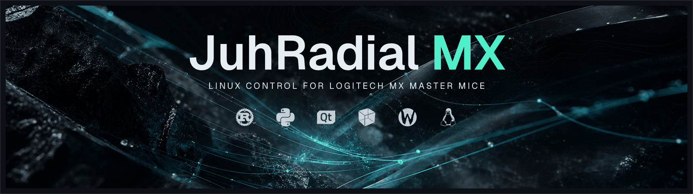
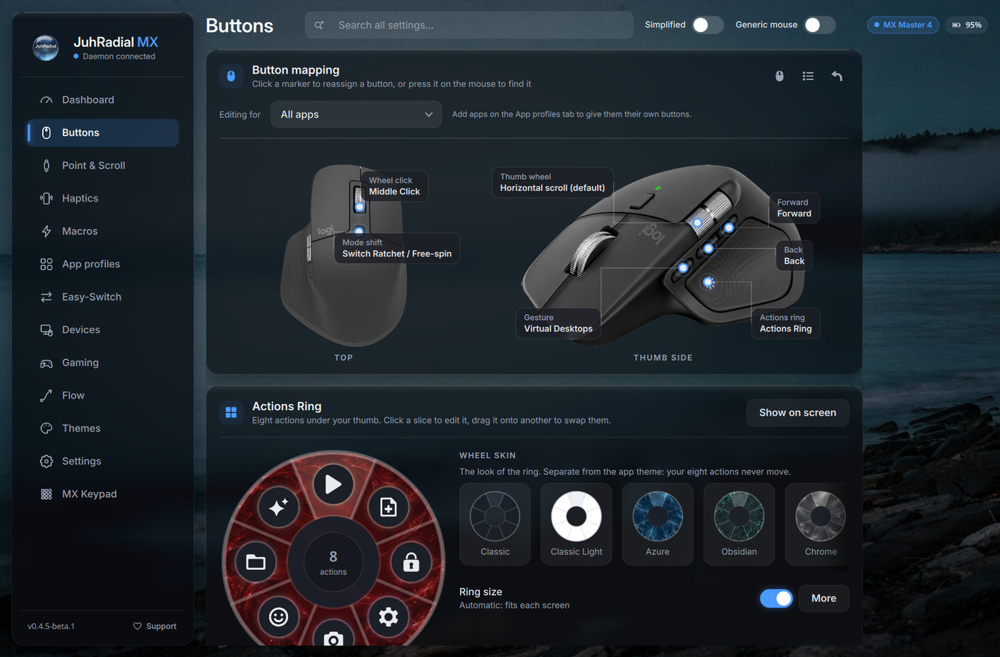
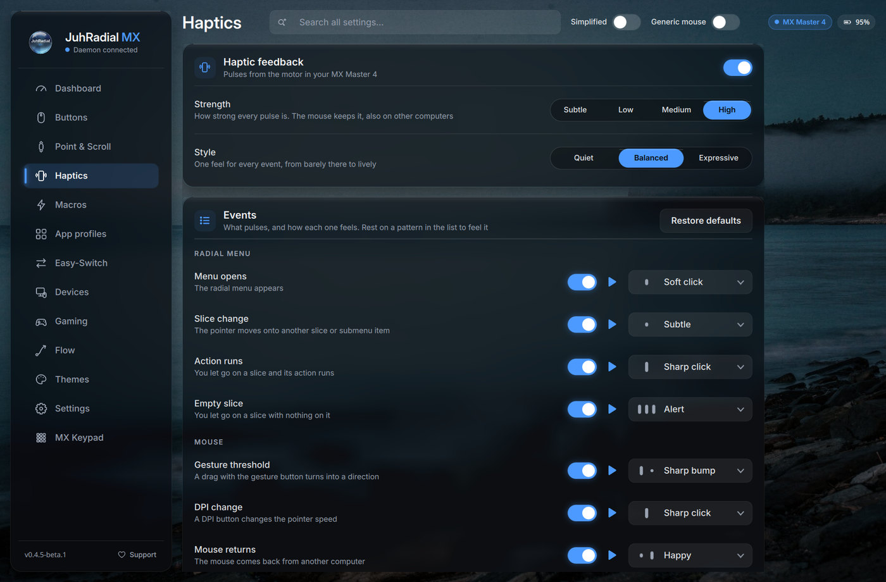
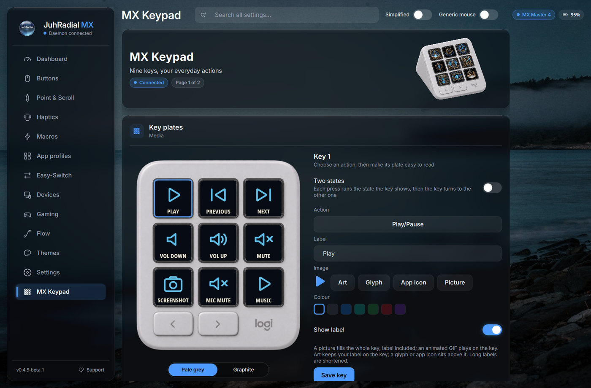
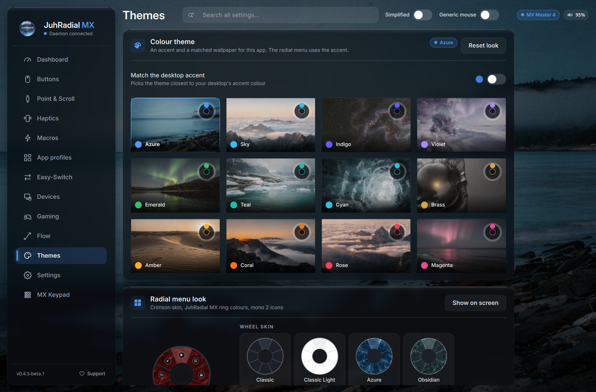
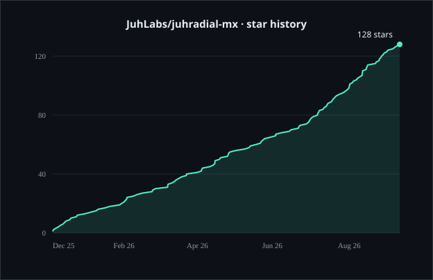

<div align="center">
  
</div>

<div align="center">
  
</div>

<div align="center">
  <p><strong>Open-source Linux control for Logitech MX Master mice, the MX Keypad and the MX Keys S.</strong></p>
  <p>Radial actions, button remapping, per-app profiles, MX Master 4 haptics, display keys, Easy-Switch and cross-computer control, on Wayland and X11.</p>

  <p>
    <a href="https://github.com/JuhLabs/juhradial-mx/releases">
      
    </a>
    <a href="https://juhlabs.github.io/juhradial-mx/">
      
    </a>
    <a href="https://github.com/JuhLabs/juhradial-mx/actions/workflows/ci.yml">
      
    </a>
    <a href="https://github.com/JuhLabs/juhradial-mx/releases">
      
    </a>
    <a href="https://www.bestpractices.dev/projects/13701">
      
    </a>
    <a href="LICENSE">
      
    </a>
    <a href="https://github.com/JuhLabs/juhradial-mx/stargazers">
      
    </a>
  </p>
</div>

## Install

Paste one line into a terminal as your normal user (not with `sudo`). The installer finds your distro, shows what it will change, and asks for `sudo` only for packages and system paths.

**Fedora, Ubuntu, Debian, Linux Mint, Pop!_OS, Zorin, Arch, Manjaro, EndeavourOS, CachyOS, openSUSE** and their derivatives:

```bash
curl -fsSL https://raw.githubusercontent.com/JuhLabs/juhradial-mx/master/install.sh | bash
```

**Bazzite, Fedora Silverblue, Kinoite and other image-based systems** (installs under `~/.local`; `sudo` only for the udev rules, `uinput` and the `input` group; add `--yes` to skip the questions):

```bash
curl -fsSL https://raw.githubusercontent.com/JuhLabs/juhradial-mx/master/install.sh | bash -s -- --user
```

**NixOS**, to try it without installing (the NixOS module is under [Other ways to install](#other-ways-to-install)):

```bash
nix run github:JuhLabs/juhradial-mx
```

If the installer adds you to the `input` group, log out and back in once. Minimal systems may need `curl` first (`sudo apt install curl` on Debian and Ubuntu). Coming from 0.4.4? Run the same line again; [Upgrading from 0.4.4](#upgrading-from-044) has the details.

<!-- DEMO GIF: record a short 3-5s clip of the radial menu (hold the gesture button,
     drag to a slice, release), save it as assets/github/demo.gif, and uncomment:
<div align="center">
  
  <br><em>Hold the gesture button, drag to a slice, release.</em>
</div>
-->

> [!NOTE]
> **This is JuhRadial MX 0.4.5 Beta (`0.4.5-beta.1`).** The release is feature complete: a redesigned Settings app, MX Keypad and MX Keys S support, and a long list of fixes. It is marked beta because so much is new, and we want it tested on more hardware and desktops before the stable 0.4.5. If something breaks or feels wrong, please [open an issue](https://github.com/JuhLabs/juhradial-mx/issues/new/choose) with your distro, desktop, device and connection (Bolt, Unifying or Bluetooth). **Devices → Copy diagnostics** in Settings copies the details and the last service log lines for you. Ideas and questions are welcome in [Discussions](https://github.com/JuhLabs/juhradial-mx/discussions).

## What's new since 0.4.4

**Added**

- **A new Settings app** built with Qt/QML: frosted glass cards, twelve colour themes with matched wallpapers, search across every setting and 18 languages. The GTK app stays as the fallback on Qt older than 6.9.
- **MX Keypad support**: nine display keys with pages, per-app profiles, key art, folders, two-state keys, text keys and shareable packs.
- **MX Keys S support** (opt-in, beta): battery, backlight, Easy-Switch follow and key remapping.
- **Directional gestures**: drag the gesture button up, down, left or right for four more actions ([#146](https://github.com/JuhLabs/juhradial-mx/issues/146)).
- **Deeper MX Master 4 haptics**: four strength levels, the Sense Panel press force and a pattern for each event.
- **Custom actions on any button**, per-app buttons, macros that record and play back on Wayland, gaming mode, plugins, and a one-zip backup of your whole setup.
- **More ways to install**: `.deb` and `.rpm` downloads, `install.sh --user` for Bazzite and Fedora Atomic ([#138](https://github.com/JuhLabs/juhradial-mx/issues/138)), a NixOS module ([#9](https://github.com/JuhLabs/juhradial-mx/issues/9)) and a native radial menu on niri ([#22](https://github.com/JuhLabs/juhradial-mx/issues/22)).

**Improved**

- Per-app profiles override only what you change and can have their own ring.
- Easy-Switch shows every computer slot and can take the MX Keys S along.
- Point & Scroll follows the mouse's real DPI range, and your settings come back after a wake or a trip to another computer.
- The menu opens faster with less HID++ traffic; quieter battery polling ([#90](https://github.com/JuhLabs/juhradial-mx/pull/90)) and batched thumb-wheel actions ([#97](https://github.com/JuhLabs/juhradial-mx/pull/97)) by [@frizikk](https://github.com/frizikk).
- Flow only talks to computers you have approved.

**Fixed**

- The ring highlights the right slice on scaled displays ([#147](https://github.com/JuhLabs/juhradial-mx/issues/147), fixed by [@iceteaSA](https://github.com/iceteaSA) in [#145](https://github.com/JuhLabs/juhradial-mx/pull/145)).
- The menu opens at the cursor on GNOME 51 ([#144](https://github.com/JuhLabs/juhradial-mx/issues/144)).
- The radial menu starts at login, and scroll speed works on KDE Plasma Wayland.
- Middle, Back and Forward remaps send real mouse buttons, and the Copy, Paste and Undo slices work.
- Haptics, battery and DPI keep working after an Easy-Switch trip, and Bluetooth mice no longer lag.
- The charging state is read correctly for the mouse and the keyboard.

The full list, with credits and issue links, is in the [changelog](CHANGELOG.md).

## What it is

JuhRadial MX is a native Linux companion for Logitech MX devices. A small Rust daemon talks HID++ to the hardware, a PyQt6 overlay draws the radial menu at your cursor, and the new Qt/QML Settings app configures everything: buttons, gestures, haptics, scrolling, per-app profiles, Easy-Switch, the MX Keypad's display keys and the MX Keys S backlight. The MX Master 4 gets the full feature set, including its haptic motor; the MX Master 3S and 3 use every control they expose, and most other mice can use generic mode for extra-button remapping.

<div align="center">
  
  <br><sub>The new Settings app: click a button on the mouse to reassign it, click a slice of the Actions Ring to edit it</sub>
</div>

## Highlights

### Mouse (MX Master 4, 3S and 3)

- **Actions Ring**: hold (or tap) a button and pick one of eight actions under your cursor. A slice can run a shortcut, app, command, link, macro or plugin action; **Pick application** on every slice and on each Quick links row lists your installed apps and puts the app's real icon on the ring. Ring size, centre zone and icon size are adjustable, or sized automatically per monitor.
- **Button remapping**: every button, plus every other control the mouse reports, can carry a shortcut (F13 to F24 included), app, command, link, macro, real mouse buttons, DPI steps, Easy-Switch targets and more. Edit for all apps, for this mouse only, or for one app profile.
- **Directional gestures**: hold the gesture button and drag up, down, left or right for four more actions, while a plain press keeps its own action.
- **Haptics per event (MX Master 4)**: four strength levels, the Sense Panel press force, and a switch and pattern for each event: menu open, slice change, action, empty slice, gesture threshold, DPI change, macros, low battery, the mouse returning from another computer, app switch and monitor switch. They live in **Settings → Haptics**, Events card; **App switch** and **Monitor switch** are in its Desktop group. Haptics can mute while gaming or while chosen apps are in front.
- **Point & Scroll**: DPI follows the range the mouse reports, SmartShift, ratchet or free-spin, scroll force, hi-res and natural scrolling, and a thumb wheel for volume, zoom or horizontal scroll. Settings are replayed after a wake, a reconnect or a trip to another computer.
- **Easy-Switch**: see each computer slot, name this computer, and switch with a confirmation that tells you how to come back.

<div align="center">
  
  <br><sub>Haptics: one switch and one pattern per event, previewed on hover</sub>
</div>

### MX Keypad

- **Nine display keys** with icons and labels, pages you flip with the two page buttons, and ready templates (Everyday, Media, Developer, Meetings).
- **Pages per app**: pages that come up by themselves while an app is in front, with ready profiles for browsers, editors and IDEs, terminals, media players, video calls, creative tools, office suites and chat apps, plus profiles for AI coding tools. Settings suggests the ones that match the apps on your computer.
- **Folders and two-state keys**: a key can open a folder page, or switch between two states (like a mute toggle). Keys can also jump to a page by name.
- **Key art and animation**: a gallery of key art in two styles, any app icon, a glyph, your own picture, or an animated GIF or WebP. Each key has its own colour and can hide its label.
- **Text keys and push to talk**: paste a text or prompt with the exact characters on any keyboard layout, or hold a shortcut down for as long as the key is held.
- **Packs**: save a group of pages as a pack and import packs, pictures and labels included.
- **Blank on screen lock**: while the screen is locked the keys go dark and do nothing, so a text key never types into the lock screen.

<div align="center">
  
  <br><sub>MX Keypad: the key plates as they look on the device, with the key editor beside them</sub>
</div>

### MX Keys S (opt-in)

- **Battery and backlight**: battery level on the Dashboard and the Devices page, the backlight level and mode read back from the keyboard, and the keyboard's own backlight keys reflected in Settings right away.
- **Easy-Switch follow**: "Mouse and keyboard move together" sends the keyboard to the same computer as the mouse, and pressing an Easy-Switch key on the keyboard takes the mouse along.
- **Key remapping**: rewrite keys (CapsLock to Ctrl and friends) through a virtual keyboard. Keyboard support is off by default and marked beta.

### Settings app and look

- **Redesigned Settings**: the GTK app is replaced by a Qt/QML app with frosted glass cards, real product photos with clickable callouts, a Dashboard with live device state, search across every setting (Ctrl+K), keyboard navigation, and **Simplified** and **Generic mouse** quick switches in the header.
- **Twelve colour themes**, each with a matched wallpaper (Azure, Sky, Indigo, Violet, Emerald, Teal, Cyan, Brass, Amber, Coral, Rose, Magenta), a gallery of wheel skins, four icon styles, hover previews on the ring, and **Reduce transparency** for solid cards.
- **Tray**: the tray tooltip names the mouse, its battery, the Easy-Switch host and the active profile, with a low-battery notice.

<div align="center">
  
  <br><sub>Themes: twelve accents with matched wallpapers, and wheel skins picked separately</sub>
</div>

### Profiles, automation and more

- **Per-app profiles** that override only what you change, with their own buttons and their own ring. **Try now** applies a profile for a minute as if its app were in front, and Settings offers a profile the first time a new app takes focus.
- **Macros**: record from any keyboard and mouse, edit the steps, bind a trigger, and play back on Wayland and X11.
- **Gaming mode**: DPI presets, a hidden ring in games, a locked wheel mode, and an automatic mode that turns on while GameMode runs a game.
- **Flow**: move the cursor and clipboard to another computer on your network. New computers must be approved once in **Settings → Flow**; hold Ctrl to cross, send the cursor now, and identify screens. See [JuhFlow](#juhflow).
- **Plugins**: a folder with a `plugin.json` adds actions to the slice picker. See the [plugins guide](https://juhlabs.github.io/juhradial-mx/plugins/).
- **Backup**: **Settings → Settings → Backup** exports your whole setup (config, profiles, macros, icons, themes) to one zip and imports it on this or another computer. Flow pairing keys never leave the machine.

The full list, with credits and issue links, is in the [changelog](CHANGELOG.md).

## Supported devices and desktops

### Devices

| Device | Support |
|---|---|
| **Logitech MX Master 4** | Primary target: HID++ controls, Actions Ring, remapping, directional gestures, Easy-Switch, live state and haptics. |
| **Logitech MX Master 3S / 3** | Everything above except haptics (these mice have no haptic motor), with their own product photo and button layout. |
| **Logitech MX Keypad** (USB) | Display keys, pages, app profiles, folders and packs. |
| **Logitech MX Keys S** | Battery, backlight, Easy-Switch follow and key remapping, opt-in and in beta. |
| **Other Logitech HID++ mice** | The controls the mouse reports can be assigned (for example the side buttons of an MX Anywhere). Not every model has been tested. |
| **Most other mice** | Generic evdev mode for extra-button radial input and remapping. |

Bolt, Unifying and Bluetooth connections are supported, including two receivers on one machine.

### Desktops

| Desktop | Menu placement | Per-app profiles and app-switch haptics |
|:---|:---|:---|
| **KDE Plasma 6** | KWin script | All apps |
| **GNOME 45 to 51** | Cursor helper extension (installed by the one-line installer) | XWayland apps only |
| **Hyprland** | IPC socket | All apps |
| **COSMIC** | XWayland | XWayland apps only |
| **sway / wlroots** | XWayland | XWayland apps only |
| **niri** | Native layer-shell surface with `gtk4-layer-shell`, otherwise XWayland through `xwayland-satellite` | XWayland apps only |
| **X11** (any desktop) | XQueryPointer | All apps |

**Known limits, workarounds and what is being worked on**

- **Per-app profiles on GNOME, COSMIC, sway and niri.** Per-app profiles, app-switch haptics and MX Keypad app pages only see XWayland apps there, because these desktops do not tell other programs which native Wayland window has focus. *Workaround:* start the app under XWayland, for example with `--ozone-platform=x11` for Chromium and Electron apps or `QT_QPA_PLATFORM=xcb` for Qt apps. *Being worked on:* reading the focused window through the desktops' own interfaces (the GNOME helper extension, sway and niri IPC).
- **Monitor-switch haptic on COSMIC and niri.** It can be missed or late, because the pointer position is only visible over XWayland windows there. *Being worked on:* following the desktop's own active monitor where it offers one.
- **niri without `gtk4-layer-shell`.** The installer adds `gtk4-layer-shell` wherever the distro packages it, and the menu then opens at the pointer. *Workaround* where it is not packaged (for example openSUSE's default repositories): run `xwayland-satellite`.
- **MX Keypad on a locked screen.** The keys go blank on lock on desktops that report the lock to logind, such as KDE Plasma and GNOME; on other desktops they stay active. *Being worked on:* more lock screens, such as swaylock and hyprlock.
- **Settings on Qt older than 6.9** (for example Ubuntu 24.04 and Debian 13). The previous GTK Settings app opens instead, without the MX Keypad tab and the other new pages; the radial menu, buttons and keypad keep working. Debian 12 (Qt 6.4, libadwaita 1.2) can run neither Settings app. *Workaround:* set things up in the new app on another computer and bring them over with **Backup**, or edit `~/.config/juhradial/config.json`. *Being worked on:* the new Settings app on older Qt versions.

See [compositor support](https://juhlabs.github.io/juhradial-mx/compositor-support/) for the details per desktop.

## Other ways to install

| Path | How |
|---|---|
| **Debian / Ubuntu package** | Download the `.deb` from the [release](https://github.com/JuhLabs/juhradial-mx/releases), then `sudo apt install ./juhradial-mx_*.deb` |
| **Fedora package** | Download the `.rpm` from the [release](https://github.com/JuhLabs/juhradial-mx/releases), then `sudo dnf install ./juhradial-mx-*.rpm` |
| **Arch Linux** | Build [packaging/arch/PKGBUILD](packaging/arch/PKGBUILD) with `makepkg -si` (not on the AUR yet) |
| **NixOS module** | Add the flake input, import `juhradial-mx.nixosModules.default` and set `services.juhradial-mx.enable = true;` |
| **Nix, try it** | `nix run github:JuhLabs/juhradial-mx` |
| **From source** | [Clone the repository](https://github.com/JuhLabs/juhradial-mx.git), build `daemon/` with Cargo, then run `scripts/juhradial-mx.sh` |
| **Flatpak** | An experimental [manifest](packaging/org.juhlabs.JuhRadialMX.yaml); not published |

The `.deb` and `.rpm` install the program, udev rules and user service, but not the per-user setup the installer does. After installing one, add yourself to the `input` group (`sudo usermod -aG input $USER`), log out and back in, run `systemctl --user enable --now juhradialmx-daemon`, then start `juhradial-mx`. GNOME needs the cursor helper extension, which only the one-line installer sets up, so GNOME users should prefer the installer. The [installation guide](https://juhlabs.github.io/juhradial-mx/installation/) covers requirements, manual setup per distro and NixOS.

## Upgrading from 0.4.4

1. Optional: back up your setup with `cp -r ~/.config/juhradial ~/juhradial-backup`.
2. Re-run the same one-line command (with `--user` if you installed that way). Your configuration is kept; new settings start at their defaults.
3. On GNOME, log out and back in once so the updated cursor helper loads (it now declares GNOME 45 to 51).
4. Open Settings. It is now the new Qt app. If your Qt is older than 6.9, the GTK app opens as before; `JUHRADIAL_SETTINGS=gtk juhradial-settings` forces it.
5. If you use Flow, approve your other computer once in **Settings → Flow**. Computers you have not approved no longer receive the clipboard or control the cursor.
6. If the MX Keypad is not found right after the upgrade, unplug it and plug it back in so the new device rules apply.

## Configuration and docs

Settings writes everything to:

```text
~/.config/juhradial/config.json
```

The daemon reloads it when Settings saves, so there is nothing to restart. The same backup that Settings makes is available from the command line:

```bash
juhradiald --export ~/juhradial-backup.zip
juhradiald --import ~/juhradial-backup.zip
```

| Guide | What it covers |
|---|---|
| [Documentation home](https://juhlabs.github.io/juhradial-mx/) | Overview and page index |
| [Installation](https://juhlabs.github.io/juhradial-mx/installation/) | Installer steps, user mode, manual setup, NixOS, updating |
| [Features](https://juhlabs.github.io/juhradial-mx/features/) | What each feature does |
| [Configuration](https://juhlabs.github.io/juhradial-mx/configuration/) | `config.json` keys and defaults |
| [Plugins](https://juhlabs.github.io/juhradial-mx/plugins/) | Writing a plugin, with examples in [examples/plugins](examples/plugins) |
| [Compositor support](https://juhlabs.github.io/juhradial-mx/compositor-support/) | Per-desktop behaviour and Hyprland rules |
| [Troubleshooting](https://juhlabs.github.io/juhradial-mx/troubleshooting/) | Service, permissions, compositor and device diagnostics |
| [FAQ](https://juhlabs.github.io/juhradial-mx/faq/) | Common questions |

## Languages

Settings is available in English and 18 more languages: Arabic, Chinese (Simplified), Dutch, French, German, Hindi, Italian, Japanese, Korean, Norwegian Bokmål, Polish, Portuguese (Brazil), Russian, Spanish, Swedish, Thai, Turkish and Ukrainian. It follows your desktop's language by default; **Settings → Language** picks another one. Corrections from native speakers are welcome as issues or pull requests.

## JuhFlow

JuhFlow moves the cursor and clipboard between Linux and macOS over the local network, with no cloud account or relay.

<div align="center">
  <a href="https://github.com/JuhLabs/juhradial-mx/raw/master/juhflow/JuhFlow.dmg">
    
  </a>
  <br><br>
  <sub>macOS companion disk image</sub>
</div>

| Area | Status |
|---|---|
| **Linux** | Built in; turn on Flow in Settings and approve the other computer there. |
| **macOS** | Download `JuhFlow.dmg`, then follow the runtime setup in [juhflow/README.md](juhflow/README.md). |
| **Network and security** | Local UDP discovery with X25519 key agreement and AES-256-GCM encrypted control and clipboard payloads. Only computers you approve (their key fingerprint is pinned) get the clipboard or the cursor. |
| **Windows** | Companion support is planned. |

> [!WARNING]
> The checked-in macOS disk image is not a standalone installer. Its GUI launches `~/Downloads/juhflow/.venv/bin/python3` and `~/Downloads/juhflow/juhflow_app.py` at fixed paths. Place the engine and virtual environment there, or run the Python CLI directly. Runtime dependencies are described in [juhflow/README.md](juhflow/README.md), including `cryptography`, PyObjC, and `blueutil`. Easy-Switch automation also expects the Logi Options+ agent.

> [!IMPORTANT]
> If JuhRadial MX is closed while JuhFlow is connected, restart JuhFlow on macOS and reconnect.

## Troubleshooting

| Problem | Resolution |
|---|---|
| Menu does not appear | Check the daemon with `systemctl --user status juhradialmx-daemon`, or restart it from the desktop launcher. |
| Menu opens at the top-left on GNOME | Log out and back in to load the cursor helper, or run `gnome-extensions enable juhradial-cursor@dev.juhlabs.com`. |
| Mouse, keypad or keyboard is not detected | Check that your user is in the `input` group and that the udev rules are installed, then log out and back in. |
| Settings opens the old GTK window | Your Qt is older than 6.9. Install PyQt6 6.9 or newer, or keep using the GTK app. |
| Menu is hidden on Hyprland | Add the rules from the [compositor support guide](https://juhlabs.github.io/juhradial-mx/compositor-support/). |
| Build fails | Install the development packages for your distro, including `hidapi-devel` and `dbus-devel` on Fedora-family systems. |

**Settings → Settings** has a troubleshooting card with the service and overlay status, a restart button, the log and **Report a bug**. For verbose daemon output:

```bash
journalctl --user -u juhradialmx-daemon -f
```

See the [troubleshooting guide](https://juhlabs.github.io/juhradial-mx/troubleshooting/) for more.

## Uninstall

<details>
<summary>Remove a system install (the default one-line install)</summary>

Stop user services before deleting installed files. The daemon and overlay run as the current user, so the user-service, autostart, and configuration steps do not require root. Files under `/usr/local`, `/usr/share`, and `/etc` do.

> [!CAUTION]
> Removing `~/.config/juhradial` deletes themes, button maps, macros, profiles, keypad pages, and Flow pairing state.

```bash
# 1. Stop and disable the JuhRadial user service
systemctl --user disable --now juhradialmx-daemon.service
rm -f ~/.config/systemd/user/juhradialmx-daemon.service

# Only run these two lines if JuhRadial created this user unit
systemctl --user disable --now ydotoold.service
rm -f ~/.config/systemd/user/ydotoold.service

systemctl --user daemon-reload

# 2. Remove the autostart entry
rm -f ~/.config/autostart/juhradial-mx.desktop

# 3. Remove binaries, assets, desktop entries, and the icon
sudo rm -f  /usr/local/bin/juhradiald \
            /usr/local/bin/juhradial-mx \
            /usr/local/bin/juhradial-settings
sudo rm -rf /usr/share/juhradial /opt/juhradial-mx
sudo rm -f  /usr/share/applications/juhradial-mx.desktop \
            /usr/share/applications/org.kde.juhradialmx.settings.desktop \
            /usr/share/icons/hicolor/scalable/apps/juhradial-mx.svg

# 4. Remove udev rules and uinput module configuration, then reload
sudo rm -f  /etc/udev/rules.d/99-juhradialmx.rules \
            /etc/udev/rules.d/60-ydotool-uinput.rules \
            /etc/modules-load.d/juhradial-uinput.conf
sudo udevadm control --reload-rules && sudo udevadm trigger

# 5. Remove user configuration
rm -rf ~/.config/juhradial
```

GNOME users should also disable and remove the cursor helper:

```bash
gnome-extensions disable juhradial-cursor@dev.juhlabs.com
rm -rf ~/.local/share/gnome-shell/extensions/juhradial-cursor@dev.juhlabs.com
```

Hyprland users should remove the `JuhRadial MX` rules block added under `~/.config/hypr/`, typically `~/.config/hypr/juhradial-rules.conf` or a section in `hyprland.conf`.

</details>

A user-mode install (`--user`) is removed with the steps in the [installation guide](https://juhlabs.github.io/juhradial-mx/installation/#bazzite-fedora-atomic-and-other-image-based-systems). Packages are removed with your package manager.

## Architecture

| Component | Role |
|---|---|
| `daemon/` | Rust HID++, evdev, D-Bus, device-state, keypad and cursor-detection service (`juhradiald`) |
| `crates/mx-keypad/` | MX Keypad protocol crate (MIT or Apache-2.0) |
| `overlay/` | PyQt6 radial menu, Linux Flow engine, and the GTK settings app kept as a fallback |
| `settings-qt/` | Qt/QML Settings app |
| `gnome-extension/` | GNOME Wayland cursor-position helper |
| `juhflow/` | Swift and Python macOS companion |
| `packaging/` | Desktop integration, systemd, udev, Debian, RPM, Arch, Nix and Flatpak manifests |

See [docs/architecture.md](docs/architecture.md) for the component boundaries and data flow.

## Contributing, conduct and security

Contributions are welcome: code, translations, hardware reports and testing on desktops we do not run every day. Read [CONTRIBUTING.md](CONTRIBUTING.md) for the development setup and pull request guidelines.

Everyone taking part is expected to follow the [Code of Conduct](CODE_OF_CONDUCT.md).

Please report security issues privately as described in the [security policy](.github/SECURITY.md), not in public issues.

## Credits

JuhRadial MX is maintained by [JuhLabs](https://github.com/JuhLabs) with co-maintainer [@gcarmin](https://github.com/gcarmin), who designed and built the application picker ([#117](https://github.com/JuhLabs/juhradial-mx/pull/117), [#118](https://github.com/JuhLabs/juhradial-mx/pull/118)), the app-switch, monitor-switch and submenu haptics ([#119](https://github.com/JuhLabs/juhradial-mx/pull/119), [#120](https://github.com/JuhLabs/juhradial-mx/pull/120), [#122](https://github.com/JuhLabs/juhradial-mx/pull/122)), the adjustable ring size ([#137](https://github.com/JuhLabs/juhradial-mx/pull/137)) and the MX Master 3/3S layout with real device names ([#136](https://github.com/JuhLabs/juhradial-mx/pull/136)), and diagnosed the Bluetooth reconnect loop ([#124](https://github.com/JuhLabs/juhradial-mx/pull/124)).

Thanks to everyone who contributed to this release:

- [@iceteaSA](https://github.com/iceteaSA): the ring geometry fix for scaled displays ([#145](https://github.com/JuhLabs/juhradial-mx/pull/145)), and the directional gestures request and config layout ([#146](https://github.com/JuhLabs/juhradial-mx/issues/146), [#148](https://github.com/JuhLabs/juhradial-mx/pull/148)).
- [@frizikk](https://github.com/frizikk): quieter battery polling ([#90](https://github.com/JuhLabs/juhradial-mx/pull/90)) and batched thumb-wheel actions ([#97](https://github.com/JuhLabs/juhradial-mx/pull/97)), following the 0.4.3 performance work.
- [@FoxQwartz](https://github.com/FoxQwartz): the hardware-level SmartShift, hi-res scroll and Devices reports behind 0.4.4 ([#106](https://github.com/JuhLabs/juhradial-mx/issues/106), [#107](https://github.com/JuhLabs/juhradial-mx/issues/107), [#108](https://github.com/JuhLabs/juhradial-mx/issues/108)).
- [@sandking1101](https://github.com/sandking1101): the Bazzite user-mode request and the slow-login diagnosis ([#138](https://github.com/JuhLabs/juhradial-mx/issues/138)).
- [@sndev28](https://github.com/sndev28): confirming the Bluetooth reconnect loop on hardware ([#126](https://github.com/JuhLabs/juhradial-mx/pull/126)).
- [@TomiEckert](https://github.com/TomiEckert) (niri, [#22](https://github.com/JuhLabs/juhradial-mx/issues/22)), [@GarrettGR](https://github.com/GarrettGR) (NixOS module, [#9](https://github.com/JuhLabs/juhradial-mx/issues/9)), [@LightOSproblems](https://github.com/LightOSproblems) (ring scaling), [@YacineSahli](https://github.com/YacineSahli) ([#127](https://github.com/JuhLabs/juhradial-mx/issues/127)) and [@Addonis-13](https://github.com/Addonis-13) ([#128](https://github.com/JuhLabs/juhradial-mx/issues/128), [#129](https://github.com/JuhLabs/juhradial-mx/issues/129)) for their requests and reports.

Every contribution is credited where it landed in the [changelog](CHANGELOG.md).

## License

JuhRadial MX is licensed under the [GNU General Public License v3.0](LICENSE). The `crates/mx-keypad` protocol crate is available under MIT or Apache-2.0.

## Star history

<div align="center">
  <a href="https://github.com/JuhLabs/juhradial-mx/stargazers">
    
  </a>
</div>

<!-- Chart is rendered weekly by .github/workflows/star-history.yml.
     GitHub restricts stargazer timestamps to repository admins, so external
     chart services (star-history.com) can no longer serve public embeds. -->

If JuhRadial MX is useful to you, a star helps other Linux users find the project.

## Trademark notice

JuhRadial MX is not affiliated with, endorsed by, or associated with Logitech. Logitech, MX Master, MX Keys, MX Keypad, Logi Options+, and related names are trademarks of Logitech International S.A. This is an independent, community-built open-source project.

<p align="center">
  Maintained by <a href="https://github.com/JuhLabs">JuhLabs</a>
  <br><br>
  <a href="https://github.com/JuhLabs/juhradial-mx/issues">Report a bug</a>
  &nbsp;&middot;&nbsp;
  <a href="https://github.com/JuhLabs/juhradial-mx/issues">Request a feature</a>
  &nbsp;&middot;&nbsp;
  <a href="https://github.com/JuhLabs/juhradial-mx/discussions">Discussions</a>
</p>
