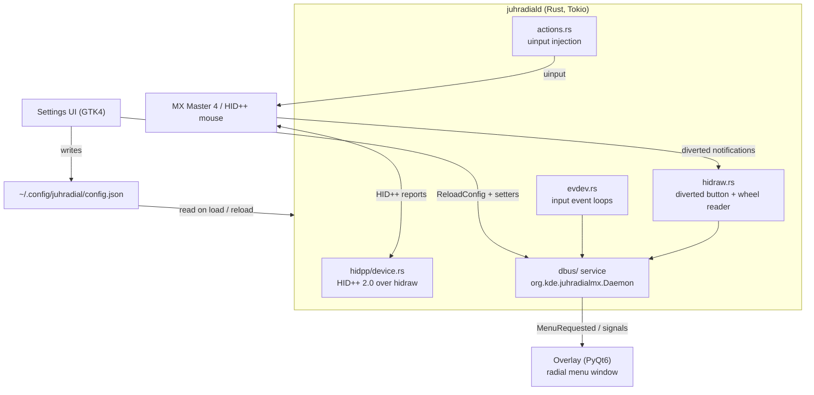

# Architecture

This page is for contributors. It explains how JuhRadial MX is put together: the three processes that make up the running system, how they talk to each other over D-Bus, and how the daemon speaks HID++ 2.0 to the mouse. If you are here to fix a bug or add a feature, start here, then jump to the module that owns the behaviour.

For installing and using the tool, see [Installation](installation.md) and [Features](features.md). For per-compositor behaviour see [Compositor-Support](compositor-support.md), and for known issues see [Troubleshooting](troubleshooting.md).

!!! note
    JuhRadial MX is a Linux power tool for the Logitech MX Master 4 and related HID++ mice. It provides a radial gesture menu, haptics, button remapping, scroll and SmartShift control, thumb-wheel horizontal scroll, Easy-Switch host control, macros, and per-app hardware profiles (Flow).


## System overview

The system is three cooperating processes that share state only through D-Bus and the on-disk config:

| Component | Language / toolkit | Binary / entry point | Responsibility |
| --- | --- | --- | --- |
| Daemon | Rust (Tokio) | `juhradiald` | Talks HID++ to the device, diverts buttons and the thumb wheel, reads input via evdev and hidraw, injects actions through uinput, and exposes the D-Bus service. |
| Overlay | Python, PyQt6 | `overlay/juhradial-overlay.py` | The radial menu window. Subscribes to `MenuRequested(x, y)`, positions itself at the cursor, and renders the wheel. |
| Settings UI | Python, GTK4 | `overlay/settings_*.py` | Configuration app. Writes `~/.config/juhradial/config.json` and calls `ReloadConfig`. |



### Why three processes

- The daemon needs raw device access (`hidraw`, `evdev`, `uinput`) and runs as a long-lived service. Keeping it in Rust gives a single static binary with no GUI dependencies.
- The overlay and settings UI are user-session GUI apps. Splitting them out keeps the privileged input path free of toolkit event loops, and lets either UI restart without disturbing button divert state on the device.
- All cross-process coordination goes through the D-Bus session bus, so a restart of any one process re-attaches cleanly (subject to the subscription gotcha below).

## The daemon

`juhradiald` is an async Tokio binary. `main.rs` wires up the shared state, probes the device, registers the D-Bus service, then spawns a set of long-running tasks and waits on a `tokio::select!` for shutdown.

### Key modules

| Module | Role |
| --- | --- |
| `hidpp/device.rs` | The `HidppDevice` wrapper: device discovery, HID++ 2.0 protocol I/O, feature enumeration, button divert, haptics, DPI, SmartShift/HiResScroll, thumb wheel, battery, Easy-Switch. |
| `hidpp/constants.rs` | Feature IDs, report types, product IDs, and the safety blocklist. |
| `hidraw.rs` | Reads diverted button and thumb-wheel notifications straight off the hidraw fd and turns them into `GestureEvent`s. Owns re-applying volatile diverts on reconnect. |
| `evdev.rs` | evdev input loops (MX path and generic-mouse fallback), key suppression, and gesture detection. |
| `actions.rs` | Action injection (uinput), horizontal scroll injection, and button-action execution. |
| `config.rs` | Config schema, `action_for_cid`, `remapped_button_cids`, `managed_button_cids`. |
| `cursor.rs` | Cursor-position query and the KWin script used on KDE. |
| `dbus/` | The D-Bus service (`service.rs`), the single `#[interface]` impl (`interface.rs`), and init (`init.rs`). |
| `battery.rs` | Background battery poller writing shared state. |
| `macros.rs` (module) | Macro engine, recorder, trigger map, and storage. |
| `profiles.rs` | Per-app hardware profiles (Flow) and `apply_hardware_profile`. |
| `window_tracker.rs` | Focused-window resource-class source for Flow (Hyprland / X11 paths; KWin pushes via D-Bus). |
| `presets.rs` | Desktop-portable presets resolved by `ExecutePreset`. |

### Runtime tasks

`main.rs` spawns these concurrent tasks:

- **hidraw loop** (`run_hidraw_loop`): connects to the device's hidraw node, re-applies volatile button diverts, thumb-wheel divert, and notification feature indices on every (re)connect, then reads diverted events. It owns re-applying diverts because they are reset by hotplug and Easy-Switch host changes.
- **MX evdev loop** (`run_evdev_loop`) and **generic evdev loop** (`run_generic_evdev_loop`): run simultaneously so either a Logitech MX or a generic mouse can trigger the wheel. The generic loop uses a configurable trigger button read from config.
- **event processing** (`process_gesture_events`): consumes `GestureEvent`s and turns them into D-Bus signals or action injection.
- **battery updater**: polls battery and writes the shared state behind `GetBatteryStatus`.
- **window tracker + Flow consumer**: applies a matching per-app `HardwareProfile` (volatile HID++ setters) on focus change.
- **device hotplug watcher** (`spawn_device_hotplug_watcher`): an inotify watch on `/dev/input/` that wakes the loops the instant an `event*` device appears or disappears, so reconnection does not wait on the slow safety-net poll.

!!! note
    Steady-state device rescans use a 60s safety-net interval (`DEVICE_POLL_INTERVAL_SECS`); the hidraw reconnect path uses 5s (`HIDRAW_RECONNECT_POLL_INTERVAL_SECS`). The frequent path used to rescan every 2s, which opened the active mouse's evdev node on every tick and produced periodic cursor stutter. The inotify watcher makes the timers a fallback rather than the primary trigger.


### Device discovery

`HidppDevice::open()` scans `/sys/class/hidraw` for Logitech devices (vendor `0x046D`), classifies each candidate by transport, then validates HID++ 2.0 with an IRoot ping before enumerating features. A device is only accepted as the target mouse if it exposes Adjustable DPI (`0x2201`), which filters out keyboards that also expose button-reprogramming features.

| Connection type | Source | Device indices tried |
| --- | --- | --- |
| `Usb` | Direct USB (`0xB034`) | `0xFF` |
| `Bolt` | Bolt receiver (`0xC548`) | `0x01`–`0x06` |
| `Unifying` | Unifying receiver (`0xC52B`) | `0x01`–`0x06` |
| `Bluetooth` | Virtual `uhid` device, HID bus `0005` | `0xFF` |

!!! tip
    The MX Master 4 and MX Master 3S share their direct-mode product ID across USB and Bluetooth, so the product ID alone cannot tell the transport apart. Discovery checks the HID bus id in the `uevent` first (`0003` = USB, `0005` = Bluetooth). On a Bolt or Unifying receiver, if no slot answers, the daemon sends a broadcast wake ping on slot `0xFF` and retries the scan once, which fixes the "had to replug to make it work" symptom of a sleeping receiver.


### The event flow

The gesture path is the canonical example of how a hardware event becomes a visible menu:

1. The user presses the gesture (thumb) button. Because that control is diverted (see HID++ below), the press arrives as a HID++ notification on the hidraw fd, carrying cursor coordinates.
2. `hidraw.rs` emits `GestureEvent::Pressed { x, y }` onto the gesture channel.
3. `process_gesture_events` calls the daemon's own `ShowMenu(x, y)` method, which emits the `MenuRequested(x, y)` signal.
4. The overlay receives `MenuRequested`, positions itself at the cursor, and shows the wheel.
5. On release, the daemon emits `HideMenu`; cursor motion during the gesture is broadcast as `CursorMoved(x, y)` for hover/slice selection.

`GestureEvent` variants the loops produce: `Pressed`, `Released`, `CursorMoved`, `MacroTriggered`, `ButtonActionEvent`, `ThumbwheelScroll`, and `Hardware` (decoded live device notifications such as battery, ratchet, host, and DPI changes).

## The overlay

`overlay/juhradial-overlay.py` is a PyQt6 window. It connects to the session bus and subscribes to the daemon's signals, then renders and animates the radial menu. Positioning relies on XWayland under most compositors; cursor-coordinate handling has to account for fractional scaling.

!!! warning
    The overlay forces `QT_QPA_PLATFORM=xcb`, where Qt6 high-DPI scaling is default-on, so `QWidget.move()` expects point space (physical divided by `devicePixelRatio`). The daemon's KWin cursor script reports logical pixels. Hand `move()` a logical coordinate at a scale other than 100% and the menu overshoots in proportion to distance from the monitor top-left. Convert by the cursor screen's `devicePixelRatio` (dpr = 1 is identity). See [Compositor-Support](compositor-support.md) for the niri layer-shell path.


## The settings UI

`overlay/settings_*.py` is a GTK4 application, one module per page (buttons, devices, easy-switch, flow, gaming, haptics, macros, scroll, settings). It is the only writer of `~/.config/juhradial/config.json`. After a save it calls `ReloadConfig` so the daemon re-reads the file and re-applies volatile device state (haptic patterns, thumb-wheel divert, non-gesture button diverts, and per-app hardware profiles) without a restart. Device-state pages (DPI, SmartShift, Easy-Switch, thumb wheel) call the daemon's getters and setters directly over D-Bus.

## D-Bus interface

The daemon registers a well-known name on the **session bus** and exports one object implementing one interface.

| Item | Value |
| --- | --- |
| Bus name | `org.kde.juhradialmx` |
| Object path | `/org/kde/juhradialmx/Daemon` |
| Interface | `org.kde.juhradialmx.Daemon` |

All methods, signals, and properties live in a single `#[interface]` impl block (`dbus/interface.rs`), as zbus requires. Rust method names map to PascalCase on the bus (`show_menu` becomes `ShowMenu`).

!!! warning
    Subscribe to daemon signals with an **empty** service name (`bus.connect("", path, iface, ...)`). A named match binds to the bus owner resolved at subscribe time, so a daemon restart leaves the client silently deaf. The daemon broadcasts most signals with a `None` destination.


### Methods

Menu and actions:

| Method | Signature | Purpose |
| --- | --- | --- |
| `ShowMenu` | `(i x, i y)` | Emit `MenuRequested` (suppressed while gaming mode is active). |
| `HideMenu` | `()` | Emit `HideMenu`. |
| `ShowMenuAtCursor` | `(i x, i y)` | Entry point used by the KWin cursor script. |
| `NotifySliceHover` | `(y index)` | Emit `SliceSelected`. |
| `ExecuteAction` | `(s action_id)` | Emit `ActionExecuted`. |
| `ExecutePreset` | `(s name)` | Run a desktop-portable preset by snake_case id. |

Haptics, config, and Flow:

| Method | Signature | Purpose |
| --- | --- | --- |
| `TriggerHaptic` | `(s event)` | Play the configured pattern for a UX event (`menu_appear`, `slice_change`, `confirm`, `invalid`). |
| `TriggerHapticPattern` | `(s name)` | Audition a specific named waveform. |
| `ReloadConfig` | `()` | Re-read config and re-apply volatile device state. |
| `SetProfile` | `(s name)` | Set the active profile. |
| `ReportActiveWindow` | `(s class)` | KWin script reports the focused window's resource class (drives Flow). |

Device state:

| Method | Returns / args | Feature |
| --- | --- | --- |
| `GetBatteryStatus` | `(y percent, b charging)` | UnifiedBattery `0x1004` |
| `GetDpi` / `SetDpi` / `DpiSupported` | `u16` / `(u16)` / `bool` | AdjustableDPI `0x2201` |
| `GetSmartShift` / `SetSmartShift` / `SmartShiftSupported` | `(b, y)` / `(b, y)` / `bool` | SmartShift / HiResScroll `0x2110` / `0x2111` |
| `GetHiresscrollMode` / `SetHiresscrollMode` | `(b hires, b invert, b target)` | HiResScroll `0x2111` |
| `SetThumbwheelReporting` / `ThumbwheelSupported` | `(b divert, b invert)` / `bool` | ThumbWheel `0x2150` |
| `GetHostNames` / `GetEasySwitchInfo` / `SetHost` | `as` / `(y, y)` / `(y) -> b` | HostsInfo `0x1815`, ChangeHost `0x1814` |
| `GetDeviceMode` / `GetDeviceName` | `s` / `s` | discovery result |

Macros and gaming mode:

| Method | Returns / args | Purpose |
| --- | --- | --- |
| `StartMacroRecording` / `StopMacroRecording` | `()` / `s` (JSON) | Record raw events, return events plus actions. |
| `ExecuteMacro` / `ExecuteMacroInline` / `StopMacro` | `(s id)` / `(s json)` / `()` | Play by stored id or inline JSON; stop. |
| `SaveMacro` / `DeleteMacro` / `ListMacros` | `(s json)` / `(s id)` / `s` | Persist, remove, enumerate macros. |
| `IsMacroRunning` / `ReloadMacroTriggers` | `bool` / `()` | Query engine state; reload trigger bindings. |
| `SetGamingMode` / `GetGamingMode` / `CycleGamingDpi` | `(b)` / `bool` / `s` | Toggle gaming mode (suppresses the overlay) and cycle gaming DPI. |

### Signals

| Signal | Payload | Emitted when |
| --- | --- | --- |
| `MenuRequested` | `(i x, i y)` | Gesture button pressed; show the wheel. |
| `HideMenu` | `()` | Gesture released. |
| `CursorMoved` | `(i x, i y)` | Cursor offset from menu center during a gesture. |
| `SliceSelected` | `(y index)` | A slice is hovered. |
| `ActionExecuted` | `(s action_id)` | An action id ran. |
| `BatteryChanged` | `(y percent, s status)` | Live battery notification from the device. |
| `RatchetChanged` | `(b ratchet)` | Free-spin / ratchet toggle reported by the wheel. |
| `HostChanged` | `(y host)` | Easy-Switch host change. |
| `DpiChanged` | `(q dpi)` | DPI change reported by the device. |
| `MacroPlaybackStarted` / `MacroPlaybackStopped` | `(s id)` | Macro engine state. |
| `GamingModeChanged` | `(b enabled)` | Gaming mode toggled. |

The hardware-readback signals (`BatteryChanged`, `RatchetChanged`, `HostChanged`, `DpiChanged`) are pushed from the hidraw notification path and broadcast directly on the connection; they are declared in the interface so clients can introspect them.

### Properties

| Property | Type | Meaning |
| --- | --- | --- |
| `CurrentProfile` | `s` | Active profile name. |
| `HapticsEnabled` | `b` | Whether haptics are enabled in config. |
| `DaemonVersion` | `s` | Daemon version string. |
| `DeviceMode` | `s` | `logitech` or `generic`. |
| `DeviceName` | `s` | Device name (from HID++ where available). |
| `GamingModeEnabled` | `b` | Gaming mode state. |

## HID++ 2.0 basics

HID++ 2.0 is Logitech's feature-based control protocol carried inside vendor HID reports. The daemon speaks it directly over a `hidraw` file descriptor (no userspace driver dependency).

### Report types

| Report | Byte 0 | Length | Layout |
| --- | --- | --- | --- |
| Short | `0x10` | 7 bytes | `[type, device_index, feature_index, (function << 4) | sw_id, p0, p1, p2]` |
| Long | `0x11` | 20 bytes | same header, up to 16 parameter bytes |
| Very long | `0x12` | 64 bytes | extended payload |

The low nibble of byte 3 is the software id (`0x01` for this daemon), used to match a response to its request. The device index is `0xFF` for direct USB and Bluetooth, or the receiver slot (`0x01`–`0x06`) behind a Bolt or Unifying receiver.

!!! warning
    Bluetooth-connected devices only expose the long (`0x11`) report, so every request is routed through the long path on Bluetooth. The same Bluetooth fd also carries `0x02` mouse-motion reports, so the `response[2] == 0xFF` error check in `hidpp_long_request` must be gated on report type and device index first; otherwise pointer motion misparses as a HID++ error and feature enumeration fails whenever the mouse is moving.


### Feature enumeration

A device exposes features by index. The daemon resolves IFeatureSet (`0x0001`) via IRoot, reads the feature count, then walks each index to learn its feature id and caches an id-to-index table. Indices are looked up at runtime because they differ per device and per firmware. Blocklisted features (anything that writes onboard memory) are logged but never stored, so they can never be called.

### Features used

| Feature | ID | How it is used |
| --- | --- | --- |
| IRoot | `0x0000` | Ping / protocol validation, `getFeatureIndex`. |
| IFeatureSet | `0x0001` | Enumerate features. |
| DeviceName | `0x0005` | Read the device's friendly name. |
| BatteryStatus | `0x1000` | Battery fallback for older devices (read-only). |
| UnifiedBattery | `0x1004` | Preferred battery feature for the MX Master 4 (read-only). |
| AdjustableDPI | `0x2201` | Get/set sensor DPI; also the "is a mouse" filter during discovery. |
| SmartShift (legacy) | `0x2110` | Ratchet control on older mice. |
| HiResScroll | `0x2111` | SmartShift / ratchet and hi-res scroll mode on MX Master 3/3S/4. |
| HiResWheel | `0x2121` | Read-only: learn the index to decode the wheel ratchet-changed event. |
| ThumbWheel | `0x2150` | Volatile divert so thumb-wheel rotation arrives as notifications (horizontal scroll). |
| ChangeHost | `0x1814` | Easy-Switch: read host count / current, switch host. |
| HostsInfo | `0x1815` | Read-only: paired host friendly names. |
| ReprogControls v4 | `0x1B04` | Volatile button divert (`setCidReporting`). |
| MX Master 4 haptic | `0x19B0` (alt `0x0B4E`) | Play haptic waveforms (runtime-only, never persisted). |
| Force feedback | `0x8123` | Legacy haptic pulse path for force-feedback devices. |

### Volatile vs persistent

!!! warning
    Button divert (ReprogControls `setCidReporting`), thumb-wheel divert (ThumbWheel `setThumbwheelReporting`), and haptic playback are all **volatile** runtime commands. They reset on device disconnect and on an Easy-Switch host change, and they never write to onboard memory. The daemon must re-apply them on every reconnect and on `ReloadConfig`. Features that would persist to device memory are blocklisted and excluded from the feature table on principle.


### Button divert and CIDs

A control id (CID) identifies a physical button. `divert_buttons()` enumerates controls via `getCidInfo`, checks the divertable flag (bit 5 of the flags byte), and diverts using the change-gate pattern (`TemporaryDiverted | ChangeTemporaryDivert = 0x03`). By default it diverts only:

| CID | Button |
| --- | --- |
| `0x00C3` (195) | Gesture (thumb) button |
| `0x01A0` (416) | Haptic button |

!!! note
    Back, forward, middle, and shift-wheel are **not** diverted by default, so reassigning them in the settings UI has no effect until their CIDs are added to the divert set (via `set_button_divert` / `remapped_button_cids`) and routed through `config.rs::action_for_cid`. `ReloadConfig` re-applies non-gesture diverts so a newly reassigned button takes effect immediately, and a button returned to its native default has its divert cleared, without a reconnect.


## Configuration and file layout

- Config file: `~/.config/juhradial/config.json` (written by the settings UI, read by the daemon on load and on `ReloadConfig`).
- Macros and profiles persist under the same config directory; per-app hardware profiles live in `profiles.json`.
- Install layout: `juhradiald` at `/usr/local/bin/juhradiald`; the overlay and assets under `/usr/share/juhradial`; the app directory at `/opt/juhradial-mx`.

See [Configuration](configuration.md) for the full config schema and field reference.

## Build, test, run

```bash
# Build the daemon (release)
cd daemon && cargo build --release   # or: make build

# Test and lint the daemon
cd daemon && cargo test               # HID++ tests in daemon/src/hidpp/tests.rs
cd daemon && cargo clippy

# Python tests
python -m pytest tests/test_measure_segments.py tests/test_placement.py

# Run the whole stack locally
make run                              # ./scripts/juhradial-mx.sh
```

Deploying a dev build over an install:

```bash
sudo bash scripts/sync-to-install.sh
# Note: this does NOT install udev rules. Copy them manually:
sudo cp packaging/udev/99-juhradialmx.rules /etc/udev/rules.d/
```

!!! note
    udev gotchas: Bluetooth mice are virtual `uhid` devices with no parent exposing `idVendor`, so `ATTRS{idVendor}` rules never match; match `KERNELS=="0005:046D:*"` instead. `TAG+="uaccess"` in a `99-*` file is a no-op; the effective access grant comes from `GROUP="input"`.


## See also

- [Installation](installation.md): prerequisites, the one-line installer, and packaging.
- [Features](features.md): what each capability does from the user's side.
- [Configuration](configuration.md): the config schema and action ids.
- [Compositor-Support](compositor-support.md): KDE, Hyprland, niri, and XWayland positioning.
- [Troubleshooting](troubleshooting.md): reconnection, permissions, and signal-deafness issues.
- [FAQ](faq.md): common questions.
